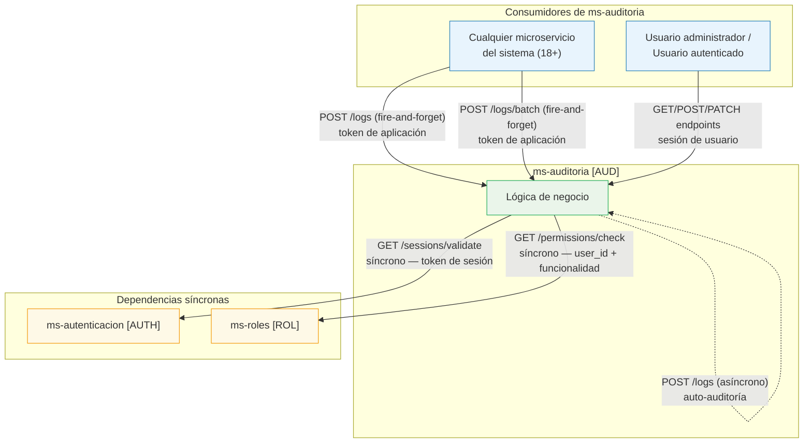
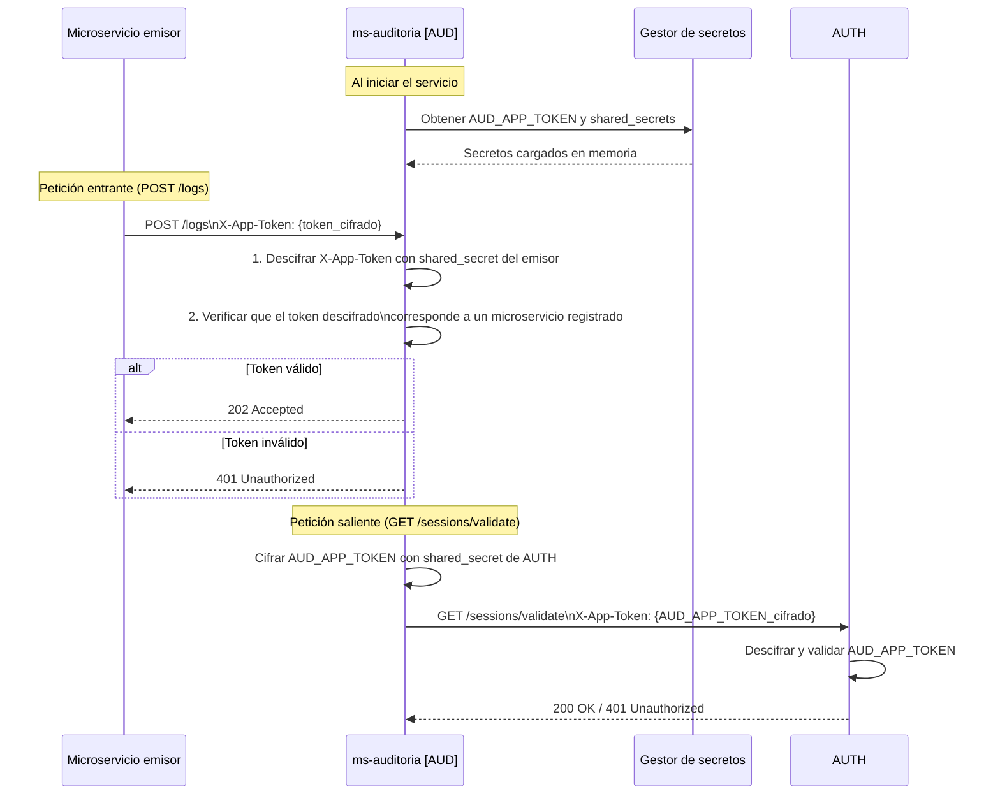
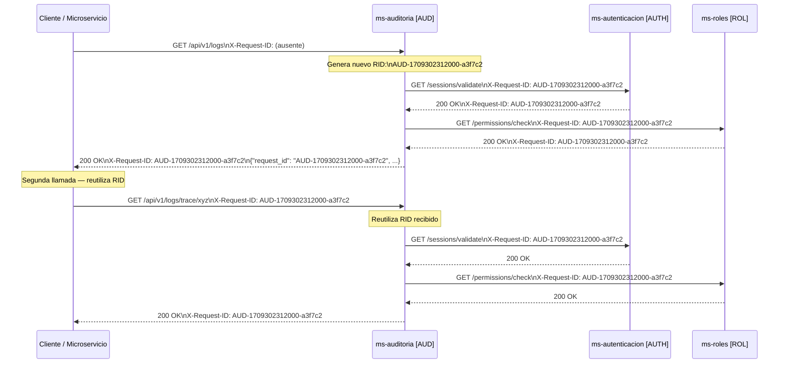
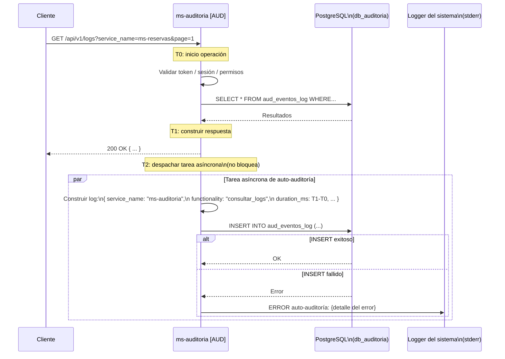
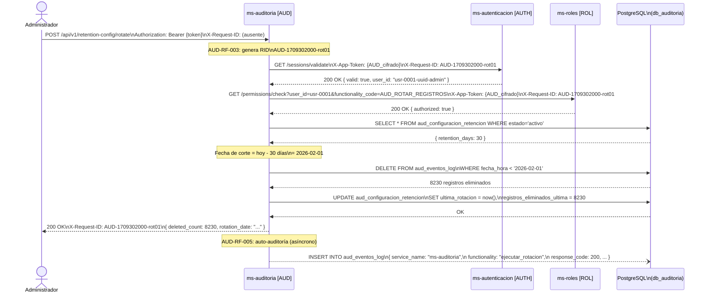
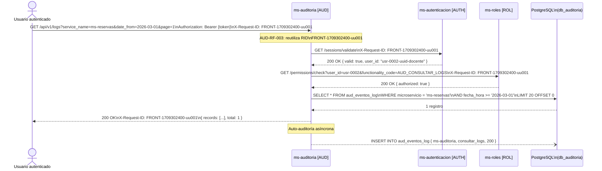
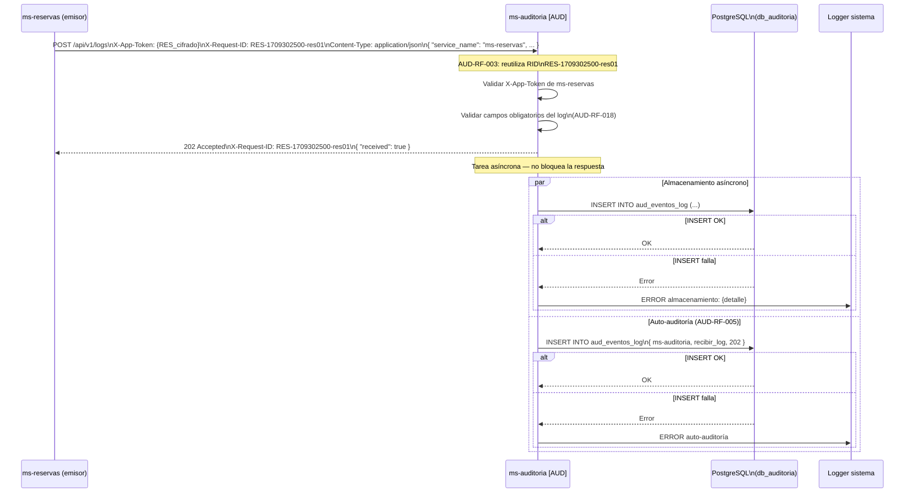

# Diseño de Integración — ms-auditoria [AUD]

**Versión:** 1.0  
**Fecha:** Marzo 2026  
**Módulo:** Módulo 6 — Transversales  
**Stack:** FastAPI + Python + PostgreSQL

---

## 1. Información General

| Campo | Detalle |
|---|---|
| **Nombre** | ms-auditoria |
| **Código** | AUD |
| **Módulo** | Módulo 6 — Transversales |
| **Servicios con los que se integra** | 2 (ms-autenticacion, ms-roles) |

`ms-auditoria` es el servicio centralizado de trazabilidad del ERP universitario: recibe logs de forma asíncrona de los 18+ microservicios del sistema y los almacena para consulta, filtrado y análisis estadístico. Para las operaciones iniciadas por usuarios humanos (consultas, configuración, rotación manual), realiza validación síncrona de sesión contra `ms-autenticacion` y verificación de permisos contra `ms-roles`. La recepción de logs enviados por otros microservicios (AUD-RF-006, AUD-RF-007) se autentica exclusivamente mediante token de aplicación, sin pasar por los servicios de sesión ni roles.

---

## 2. Mapa de Integraciones



**Descripción narrativa:**

`ms-auditoria` se integra con **2 servicios externos**: `ms-autenticacion` y `ms-roles`. Ambas integraciones son **síncronas** y bloquean el flujo hasta obtener respuesta; son dependencias críticas para todas las operaciones que requieren autenticación de usuario (AUD-RF-001, AUD-RF-002). Sin `ms-autenticacion`, ninguna consulta de usuario puede procesarse; sin `ms-roles`, no puede verificarse que el usuario tiene permiso para la operación solicitada.

La recepción de logs desde otros microservicios (AUD-RF-006, AUD-RF-007) **no depende** de estos servicios: se autentica únicamente con token de aplicación y responde de forma inmediata con `202 Accepted` antes de persistir. Esto garantiza que un fallo en `ms-autenticacion` o `ms-roles` no afecte la operación de ingesta de logs, que es la función más crítica del servicio.

La auto-auditoría (AUD-RF-005) es un mecanismo interno asíncrono: `ms-auditoria` escribe en su propia base de datos en segundo plano, sin llamadas a servicios externos.

---

## 3. Contratos de Comunicación Saliente

### 3.1 Llamadas a ms-autenticacion [AUTH]

#### Operación: Validar sesión de usuario

| Campo | Detalle |
|---|---|
| **Servicio destino** | ms-autenticacion [AUTH] |
| **Operación** | Validar sesión activa |
| **Método HTTP** | GET |
| **Endpoint sugerido** | `/api/v1/sessions/validate` |
| **Headers requeridos** | `Authorization: Bearer {session_token}`, `X-App-Token: {aud_app_token_cifrado}`, `X-Request-ID: {request_id}`, `Content-Type: application/json` |
| **Timeout sugerido** | 3 segundos |
| **Requisito relacionado** | AUD-RF-001 |

**Request (sin body — el token va en header):**

```json
{}
```

**Response exitoso (200):**

```json
{
  "request_id": "AUTH-1709300000-abc123",
  "success": true,
  "data": {
    "valid": true,
    "user_id": "usr-0001-uuid-admin",
    "expires_at": "2026-03-02T20:00:00Z"
  },
  "message": "Sesión válida",
  "timestamp": "2026-03-02T14:00:00Z"
}
```

**Response de error (401 — sesión inválida o expirada):**

```json
{
  "request_id": "AUTH-1709300000-abc123",
  "success": false,
  "data": null,
  "message": "Sesión inválida o expirada",
  "timestamp": "2026-03-02T14:00:00Z"
}
```

---

### 3.2 Llamadas a ms-roles [ROL]

#### Operación: Verificar permiso por funcionalidad

| Campo | Detalle |
|---|---|
| **Servicio destino** | ms-roles [ROL] |
| **Operación** | Verificar permiso de usuario sobre funcionalidad |
| **Método HTTP** | GET |
| **Endpoint sugerido** | `/api/v1/permissions/check` |
| **Headers requeridos** | `X-App-Token: {aud_app_token_cifrado}`, `X-Request-ID: {request_id}`, `Content-Type: application/json` |
| **Timeout sugerido** | 3 segundos |
| **Requisito relacionado** | AUD-RF-002 |

**Request (query params):**

```json
{
  "user_id": "usr-0001-uuid-admin",
  "functionality_code": "AUD_CONSULTAR_LOGS"
}
```

**Response exitoso (200 — permiso concedido):**

```json
{
  "request_id": "ROL-1709300000-def456",
  "success": true,
  "data": {
    "authorized": true,
    "user_id": "usr-0001-uuid-admin",
    "functionality_code": "AUD_CONSULTAR_LOGS"
  },
  "message": "Permiso concedido",
  "timestamp": "2026-03-02T14:00:01Z"
}
```

**Response de error (403 — permiso denegado):**

```json
{
  "request_id": "ROL-1709300000-def456",
  "success": false,
  "data": null,
  "message": "Permiso denegado para esta operación",
  "timestamp": "2026-03-02T14:00:01Z"
}
```

---

## 4. Contratos de Comunicación Entrante

### 4.1 Recepción de log individual desde cualquier microservicio

| Campo | Detalle |
|---|---|
| **Servicio origen** | Cualquier microservicio del sistema (ms-reservas, ms-matriculas, etc.) |
| **Operación** | Enviar registro de log individual (asíncrono) |
| **Método HTTP** | POST |
| **Endpoint expuesto** | `/api/v1/logs` |
| **Headers requeridos** | `X-App-Token: {emisor_app_token_cifrado}`, `X-Request-ID: {request_id}`, `Content-Type: application/json` |
| **Requisito relacionado** | AUD-RF-006 |

**Request:**

```json
{
  "timestamp": "2026-03-02T14:05:12Z",
  "request_id": "RES-1709302000-xyz789",
  "service_name": "ms-reservas",
  "functionality": "crear_reserva",
  "method": "POST",
  "response_code": 201,
  "duration_ms": 312,
  "user_id": "usr-0002-uuid-docente",
  "detail": "Reserva creada para espacio A-101, fecha 2026-03-10."
}
```

**Response exitoso (202 — recibido, procesamiento en segundo plano):**

```json
{
  "request_id": "AUD-1709302000-aud001",
  "success": true,
  "data": {
    "received": true,
    "log_request_id": "RES-1709302000-xyz789"
  },
  "message": "Registro de log recibido y en proceso de almacenamiento.",
  "timestamp": "2026-03-02T14:05:12Z"
}
```

**Response de error (401 — token de aplicación inválido):**

```json
{
  "request_id": "AUD-1709302000-aud001",
  "success": false,
  "data": null,
  "message": "Token de aplicación inválido o no proporcionado.",
  "timestamp": "2026-03-02T14:05:12Z"
}
```

**Response de error (422 — campos faltantes o malformados):**

```json
{
  "request_id": "AUD-1709302000-aud001",
  "success": false,
  "data": {
    "invalid_fields": ["response_code", "duration_ms"],
    "detail": "response_code debe ser un entero entre 100 y 599; duration_ms debe ser un entero no negativo."
  },
  "message": "El cuerpo del log no cumple el formato requerido.",
  "timestamp": "2026-03-02T14:05:12Z"
}
```

---

### 4.2 Recepción de logs en lote desde cualquier microservicio

| Campo | Detalle |
|---|---|
| **Servicio origen** | Cualquier microservicio del sistema |
| **Operación** | Enviar registros de log en lote (batch, asíncrono) |
| **Método HTTP** | POST |
| **Endpoint expuesto** | `/api/v1/logs/batch` |
| **Headers requeridos** | `X-App-Token: {emisor_app_token_cifrado}`, `X-Request-ID: {request_id}`, `Content-Type: application/json` |
| **Requisito relacionado** | AUD-RF-007 |

**Request:**

```json
{
  "logs": [
    {
      "timestamp": "2026-03-02T14:05:10Z",
      "request_id": "MAT-1709302000-001",
      "service_name": "ms-matriculas",
      "functionality": "consultar_matriculas",
      "method": "GET",
      "response_code": 200,
      "duration_ms": 95,
      "user_id": "usr-0001-uuid-admin",
      "detail": "Consulta de matrículas para periodo 2026-1."
    },
    {
      "timestamp": "2026-03-02T14:05:11Z",
      "request_id": "MAT-1709302000-002",
      "service_name": "ms-matriculas",
      "functionality": "actualizar_estado_matricula",
      "method": "PATCH",
      "response_code": 200,
      "duration_ms": 210,
      "user_id": "usr-0001-uuid-admin",
      "detail": "Matrícula MAT-2026-0042 cambiada a estado activa."
    }
  ]
}
```

**Response exitoso (202):**

```json
{
  "request_id": "AUD-1709302000-aud002",
  "success": true,
  "data": {
    "received_count": 2,
    "accepted_count": 2,
    "rejected_count": 0,
    "rejected_indices": []
  },
  "message": "Lote de logs recibido. 2 registros aceptados para almacenamiento.",
  "timestamp": "2026-03-02T14:05:12Z"
}
```

**Response de error (422 — arreglo vacío o body inválido):**

```json
{
  "request_id": "AUD-1709302000-aud002",
  "success": false,
  "data": null,
  "message": "El cuerpo debe ser un arreglo JSON no vacío.",
  "timestamp": "2026-03-02T14:05:12Z"
}
```

---

### 4.3 Consultar traza completa por Request ID

| Campo | Detalle |
|---|---|
| **Servicio origen** | Cliente HTTP con sesión de usuario autenticado |
| **Operación** | Consultar todos los logs de una traza distribuida |
| **Método HTTP** | GET |
| **Endpoint expuesto** | `/api/v1/logs/trace/{request_id}` |
| **Headers requeridos** | `Authorization: Bearer {session_token}`, `X-Request-ID: {request_id}`, `Content-Type: application/json` |
| **Requisito relacionado** | AUD-RF-008 |

**Request (query params):** `page=1&page_size=20`

**Response exitoso (200):**

```json
{
  "request_id": "AUD-1709302000-aud003",
  "success": true,
  "data": {
    "trace_request_id": "a1b2c3d4-0001-0001-0001-000000000001",
    "total_records": 2,
    "page": 1,
    "page_size": 20,
    "records": [
      {
        "id": 1,
        "timestamp": "2026-02-15T08:05:12Z",
        "service_name": "ms-autenticacion",
        "functionality": "login",
        "method": "POST",
        "response_code": 200,
        "duration_ms": 145,
        "user_id": "usr-0001-uuid-admin",
        "detail": "Inicio de sesión exitoso para usuario administrador."
      },
      {
        "id": 2,
        "timestamp": "2026-02-15T08:05:12Z",
        "service_name": "ms-roles",
        "functionality": "verificar_permisos",
        "method": "GET",
        "response_code": 200,
        "duration_ms": 32,
        "user_id": "usr-0001-uuid-admin",
        "detail": "Permisos verificados para rol ADMIN."
      }
    ]
  },
  "message": "Traza recuperada exitosamente.",
  "timestamp": "2026-03-02T14:22:10Z"
}
```

**Response de error (400 — request_id no proporcionado):**

```json
{
  "request_id": "AUD-1709302000-aud003",
  "success": false,
  "data": null,
  "message": "El parámetro request_id es obligatorio.",
  "timestamp": "2026-03-02T14:22:10Z"
}
```

---

### 4.4 Filtrar registros de log por criterios

| Campo | Detalle |
|---|---|
| **Servicio origen** | Cliente HTTP con sesión de usuario autenticado |
| **Operación** | Filtrar logs por servicio y/o rango de fechas |
| **Método HTTP** | GET |
| **Endpoint expuesto** | `/api/v1/logs` |
| **Headers requeridos** | `Authorization: Bearer {session_token}`, `X-Request-ID: {request_id}`, `Content-Type: application/json` |
| **Requisito relacionado** | AUD-RF-009 |

**Request (query params):** `service_name=ms-reservas&date_from=2026-03-01T00:00:00Z&date_to=2026-03-02T23:59:59Z&page=1&page_size=20`

**Response exitoso (200):**

```json
{
  "request_id": "AUD-1709302000-aud004",
  "success": true,
  "data": {
    "total_records": 1,
    "page": 1,
    "page_size": 20,
    "filters_applied": {
      "service_name": "ms-reservas",
      "date_from": "2026-03-01T00:00:00Z",
      "date_to": "2026-03-02T23:59:59Z"
    },
    "records": [
      {
        "id": 3,
        "request_id": "b2c3d4e5-0002-0002-0002-000000000002",
        "timestamp": "2026-03-02T09:30:45Z",
        "service_name": "ms-reservas",
        "functionality": "crear_reserva",
        "method": "POST",
        "response_code": 201,
        "duration_ms": 312,
        "user_id": "usr-0002-uuid-docente",
        "detail": "Reserva creada para espacio A-101."
      }
    ]
  },
  "message": "Registros filtrados exitosamente.",
  "timestamp": "2026-03-02T14:25:00Z"
}
```

**Response de error (400 — ningún filtro proporcionado):**

```json
{
  "request_id": "AUD-1709302000-aud004",
  "success": false,
  "data": null,
  "message": "Debe proporcionarse al menos un criterio de filtro (service_name o rango de fechas).",
  "timestamp": "2026-03-02T14:25:00Z"
}
```

---

### 4.5 Consultar configuración de retención

| Campo | Detalle |
|---|---|
| **Servicio origen** | Cliente HTTP con sesión de usuario administrador |
| **Operación** | Obtener configuración activa de retención |
| **Método HTTP** | GET |
| **Endpoint expuesto** | `/api/v1/retention-config` |
| **Headers requeridos** | `Authorization: Bearer {session_token}`, `X-Request-ID: {request_id}`, `Content-Type: application/json` |
| **Requisito relacionado** | AUD-RF-010 |

**Response exitoso (200):**

```json
{
  "request_id": "AUD-1709302000-aud005",
  "success": true,
  "data": {
    "retention_days": 30,
    "status": "activo",
    "last_rotation_date": "2026-02-15T03:00:00Z",
    "last_rotation_deleted_count": 15842
  },
  "message": "Configuración de retención obtenida exitosamente.",
  "timestamp": "2026-03-02T15:00:00Z"
}
```

**Response de error (500):**

```json
{
  "request_id": "AUD-1709302000-aud005",
  "success": false,
  "data": null,
  "message": "Error al acceder a la base de datos.",
  "timestamp": "2026-03-02T15:00:00Z"
}
```

---

### 4.6 Actualizar configuración de retención

| Campo | Detalle |
|---|---|
| **Servicio origen** | Cliente HTTP con sesión de usuario administrador |
| **Operación** | Modificar días de retención de logs |
| **Método HTTP** | PATCH |
| **Endpoint expuesto** | `/api/v1/retention-config` |
| **Headers requeridos** | `Authorization: Bearer {session_token}`, `X-Request-ID: {request_id}`, `Content-Type: application/json` |
| **Requisito relacionado** | AUD-RF-011 |

**Request:**

```json
{
  "retention_days": 60
}
```

**Response exitoso (200):**

```json
{
  "request_id": "AUD-1709302000-aud006",
  "success": true,
  "data": {
    "retention_days": 60,
    "status": "activo",
    "last_rotation_date": "2026-02-15T03:00:00Z",
    "last_rotation_deleted_count": 15842
  },
  "message": "Configuración de retención actualizada exitosamente.",
  "timestamp": "2026-03-02T15:10:00Z"
}
```

**Response de error (422 — valor inválido):**

```json
{
  "request_id": "AUD-1709302000-aud006",
  "success": false,
  "data": null,
  "message": "El campo retention_days debe ser un entero positivo mayor a cero.",
  "timestamp": "2026-03-02T15:10:00Z"
}
```

---

### 4.7 Ejecutar rotación manual de registros

| Campo | Detalle |
|---|---|
| **Servicio origen** | Cliente HTTP con sesión de usuario administrador |
| **Operación** | Disparar rotación manual de logs antiguos |
| **Método HTTP** | POST |
| **Endpoint expuesto** | `/api/v1/retention-config/rotate` |
| **Headers requeridos** | `Authorization: Bearer {session_token}`, `X-Request-ID: {request_id}`, `Content-Type: application/json` |
| **Requisito relacionado** | AUD-RF-012 |

**Request (sin body):**

```json
{}
```

**Response exitoso (200):**

```json
{
  "request_id": "AUD-1709302000-aud007",
  "success": true,
  "data": {
    "rotation_date": "2026-03-02T15:30:00Z",
    "cutoff_date": "2026-02-01T15:30:00Z",
    "deleted_count": 8230,
    "retention_days_applied": 30
  },
  "message": "Rotación manual ejecutada exitosamente. 8230 registros eliminados.",
  "timestamp": "2026-03-02T15:30:00Z"
}
```

**Response de error (500):**

```json
{
  "request_id": "AUD-1709302000-aud007",
  "success": false,
  "data": null,
  "message": "Error durante la rotación. No se eliminaron registros.",
  "timestamp": "2026-03-02T15:30:00Z"
}
```

---

### 4.8 Consultar estadísticas generales del sistema

| Campo | Detalle |
|---|---|
| **Servicio origen** | Cliente HTTP con sesión de usuario autenticado |
| **Operación** | Obtener estadísticas de todos los microservicios por periodo |
| **Método HTTP** | GET |
| **Endpoint expuesto** | `/api/v1/statistics` |
| **Headers requeridos** | `Authorization: Bearer {session_token}`, `X-Request-ID: {request_id}`, `Content-Type: application/json` |
| **Requisito relacionado** | AUD-RF-015 |

**Request (query params):** `period=diario&date=2026-03-02&page=1&page_size=20`

**Response exitoso (200):**

```json
{
  "request_id": "AUD-1709302000-aud008",
  "success": true,
  "data": {
    "period": "diario",
    "date": "2026-03-02",
    "total_records": 4,
    "page": 1,
    "page_size": 20,
    "statistics": [
      {
        "service_name": "ms-autenticacion",
        "period": "diario",
        "date": "2026-03-02",
        "total_requests": 4820,
        "total_errors": 312,
        "avg_response_time_ms": 98.50,
        "most_used_functionality": "login",
        "calculation_date": "2026-03-03T00:05:00Z"
      }
    ]
  },
  "message": "Estadísticas generales obtenidas exitosamente.",
  "timestamp": "2026-03-02T16:00:00Z"
}
```

**Response de error (422 — period inválido):**

```json
{
  "request_id": "AUD-1709302000-aud008",
  "success": false,
  "data": null,
  "message": "El parámetro period debe ser: diario, semanal o mensual.",
  "timestamp": "2026-03-02T16:00:00Z"
}
```

---

### 4.9 Consultar estadísticas detalladas de un servicio

| Campo | Detalle |
|---|---|
| **Servicio origen** | Cliente HTTP con sesión de usuario autenticado |
| **Operación** | Obtener estadísticas detalladas de un microservicio específico |
| **Método HTTP** | GET |
| **Endpoint expuesto** | `/api/v1/statistics/{service_name}` |
| **Headers requeridos** | `Authorization: Bearer {session_token}`, `X-Request-ID: {request_id}`, `Content-Type: application/json` |
| **Requisito relacionado** | AUD-RF-016 |

**Request (query params):** `period=mensual&date=2026-02-01&page=1&page_size=10`

**Response exitoso (200):**

```json
{
  "request_id": "AUD-1709302000-aud009",
  "success": true,
  "data": {
    "service_name": "ms-reservas",
    "period": "mensual",
    "total_records": 1,
    "page": 1,
    "page_size": 10,
    "statistics": [
      {
        "service_name": "ms-reservas",
        "period": "mensual",
        "date": "2026-02-01",
        "total_requests": 8970,
        "total_errors": 610,
        "avg_response_time_ms": 278.50,
        "most_used_functionality": "crear_reserva",
        "calculation_date": "2026-03-01T00:15:00Z"
      }
    ]
  },
  "message": "Estadísticas del servicio obtenidas exitosamente.",
  "timestamp": "2026-03-02T16:05:00Z"
}
```

**Response de error (400 — service_name vacío):**

```json
{
  "request_id": "AUD-1709302000-aud009",
  "success": false,
  "data": null,
  "message": "El parámetro service_name es obligatorio.",
  "timestamp": "2026-03-02T16:05:00Z"
}
```

---

### 4.10 Health Check

| Campo | Detalle |
|---|---|
| **Servicio origen** | Orquestador de contenedores, monitor, pipeline CI/CD |
| **Operación** | Verificar estado de salud del servicio |
| **Método HTTP** | GET |
| **Endpoint expuesto** | `/health` |
| **Headers requeridos** | Ninguno (endpoint público sin autenticación) |
| **Requisito relacionado** | AUD-RF-017 |

**Response exitoso (200):**

```json
{
  "status": "healthy",
  "version": "1.0.0",
  "timestamp": "2026-03-02T16:10:00Z",
  "components": {
    "database": {
      "status": "healthy",
      "latency_ms": 3
    }
  }
}
```

**Response de error (503 — base de datos no disponible):**

```json
{
  "status": "unhealthy",
  "version": "1.0.0",
  "timestamp": "2026-03-02T16:10:00Z",
  "components": {
    "database": {
      "status": "unhealthy",
      "detail": "Connection timeout after 5000ms"
    }
  }
}
```

---

## 5. Configuración de Tokens de Aplicación

### Token propio del microservicio

| Campo | Detalle |
|---|---|
| **Nombre** | `AUD_APP_TOKEN` |
| **Descripción** | Token de identidad de `ms-auditoria` para autenticarse ante `ms-autenticacion` y `ms-roles` en sus llamadas salientes. |
| **Formato de almacenamiento** | Variable de entorno cifrada en el gestor de secretos del entorno de despliegue (ej: Vault, Kubernetes Secrets). Nunca en texto plano en código fuente ni archivos de configuración versionados. |

### Tokens de otros servicios que ms-auditoria necesita validar (entrante)

Los microservicios que envían logs al servicio de auditoría (AUD-RF-006, AUD-RF-007) deben incluir su propio token de aplicación para que `ms-auditoria` pueda verificar su identidad.

| Servicio | Propósito | Uso en la cabecera |
|---|---|---|
| Cualquier microservicio del sistema (18+) | Identificar al microservicio emisor al enviar logs | `X-App-Token: {emisor_app_token_cifrado}` — `ms-auditoria` verifica que el token corresponde a un microservicio registrado del sistema |

### Tokens que ms-auditoria usa en sus llamadas salientes

| Servicio destino | Propósito | Uso en la cabecera |
|---|---|---|
| ms-autenticacion [AUTH] | Identificar a `ms-auditoria` como servicio autorizado para consultar sesiones | `X-App-Token: {AUD_APP_TOKEN_cifrado}` |
| ms-roles [ROL] | Identificar a `ms-auditoria` como servicio autorizado para consultar permisos | `X-App-Token: {AUD_APP_TOKEN_cifrado}` |

### Formato de transmisión del token en las peticiones

El token de aplicación se transmite cifrado (AES-256 o equivalente) en la cabecera HTTP `X-App-Token`. El cifrado se realiza con una clave compartida entre el servicio emisor y el receptor, gestionada en el almacén de secretos del entorno. El token nunca se transmite en texto plano.

```
X-App-Token: {base64(AES256_encrypt(app_token, shared_secret))}
```

### Flujo de validación de token entre servicios



**Descripción narrativa:**

Al iniciar `ms-auditoria`, carga desde el gestor de secretos su propio token (`AUD_APP_TOKEN`) y los secretos compartidos con cada microservicio registrado. Cuando recibe una petición entrante de un microservicio emisor (por ejemplo, `ms-reservas` enviando un log), descifra el valor del header `X-App-Token` usando el secreto compartido con ese emisor y verifica que el token descifrado sea el token registrado para ese microservicio. En sus peticiones salientes hacia `ms-autenticacion` o `ms-roles`, `ms-auditoria` cifra su propio `AUD_APP_TOKEN` con el secreto compartido con el servicio destino e incluye el resultado en el header `X-App-Token`. El servicio receptor descifra y valida de la misma forma.

---

## 6. Flujo de Request ID

### Formato del Request ID

```
AUD-{timestamp_unix_ms}-{id_corto_aleatorio}
Ejemplo: AUD-1709302312000-a3f7c2
```

- **Prefijo:** Código del microservicio (`AUD`), en mayúsculas.
- **Timestamp:** Marca de tiempo Unix en milisegundos al momento de recibir la petición.
- **ID corto:** Cadena alfanumérica aleatoria de 6 caracteres para evitar colisiones en el mismo milisegundo.
- **Longitud total:** ≤ 36 caracteres (compatible con `VARCHAR(36)` del modelo de datos).

### Reglas de generación y reutilización

1. Al recibir cada petición HTTP, `ms-auditoria` inspecciona el header `X-Request-ID`.
2. Si el header `X-Request-ID` está presente y tiene formato válido, se **reutiliza** el valor recibido para toda la operación. Esto permite encadenar la traza con el microservicio que originó la petición.
3. Si el header `X-Request-ID` no está presente, o tiene formato inválido, se **genera** un nuevo Request ID con el formato `AUD-{timestamp_unix_ms}-{id_corto}`.
4. El Request ID se adjunta al contexto de la petición y se propaga en **todas las llamadas salientes** a `ms-autenticacion` y `ms-roles` mediante el mismo header `X-Request-ID`.
5. El Request ID se incluye en el **header de respuesta** (`X-Request-ID`) y en el **cuerpo de respuesta** (campo `request_id`).
6. El Request ID que se almacena en el log de auto-auditoría (AUD-RF-005) es siempre el de la petición que originó la operación.

### Diagrama de propagación del Request ID



**Descripción narrativa:**

El Request ID se genera en el primer middleware de `ms-auditoria` al momento de recibir la petición, antes de ejecutar cualquier lógica de negocio. Si el cliente o microservicio emisor incluye un `X-Request-ID` válido en el header, `ms-auditoria` lo reutiliza íntegramente para mantener la traza distribuida de extremo a extremo. Si el header está ausente o su formato es inválido, se genera uno nuevo con el prefijo `AUD`. El Request ID generado o reutilizado se propaga inmediatamente a todas las llamadas salientes hacia `ms-autenticacion` y `ms-roles`, garantizando que todos los servicios participantes en el flujo compartan el mismo identificador de traza. La respuesta final al cliente siempre incluye el Request ID tanto en el header `X-Request-ID` como en el campo `request_id` del cuerpo JSON.

---

## 7. Flujo de Auditoría

### Estructura completa del log JSON

```json
{
  "timestamp": "2026-03-02T14:22:10Z",
  "request_id": "AUD-1709302130000-b9d4e1",
  "service_name": "ms-auditoria",
  "functionality": "consultar_logs",
  "method": "GET",
  "response_code": 200,
  "duration_ms": 89,
  "user_id": "usr-0001-uuid-admin",
  "detail": "Consulta de logs filtrada por ms-reservas, página 1. Total 1 registro retornado."
}
```

**Campos del log:**

| Campo | Tipo | Descripción |
|---|---|---|
| `timestamp` | ISO 8601 | Fecha y hora en que finalizó la operación en `ms-auditoria` |
| `request_id` | String | Request ID de la petición que originó esta operación |
| `service_name` | String | Siempre `"ms-auditoria"` para la auto-auditoría |
| `functionality` | String | Nombre de la funcionalidad ejecutada (ej: `consultar_logs`, `ejecutar_rotacion`) |
| `method` | String | Método HTTP de la petición entrante |
| `response_code` | Integer | Código HTTP de la respuesta emitida |
| `duration_ms` | Integer | Duración total de la operación en milisegundos |
| `user_id` | String / null | ID del usuario que realizó la petición, o `null` para operaciones de sistema (scheduler) |
| `detail` | String | Descripción del resultado: registros procesados, parámetros usados, errores encontrados |

### Momento de generación

El log de auto-auditoría se construye **después de emitir la respuesta** al solicitante. El flujo es: ejecutar la operación → construir respuesta → emitir respuesta → disparar tarea asíncrona de auto-auditoría. Esto garantiza que el campo `response_code` y `duration_ms` reflejan el resultado real de la operación.

### Comportamiento ante fallos del servicio de auditoría

Dado que `ms-auditoria` se auto-audita escribiendo directamente en su propia base de datos (sin llamar a ningún servicio externo), el único punto de fallo es la escritura en PostgreSQL. Si falla, el error se registra en el logger de sistema (`stderr`) pero **no afecta** la respuesta ya emitida ni el flujo principal. El mecanismo de auto-auditoría no genera otro log (sin bucles infinitos, conforme a AUD-RF-005).

### Diagrama del flujo asíncrono de auto-auditoría



**Descripción narrativa:**

Al finalizar cualquier operación, `ms-auditoria` emite primero la respuesta HTTP al cliente y, a continuación, despacha una tarea asíncrona en segundo plano (mediante un worker/thread pool de FastAPI o una cola interna) para persistir el log de auto-auditoría. La tarea construye el objeto de log con todos los campos del formato estándar, incluyendo la duración real de la operación medida hasta el momento de emitir la respuesta. El log se inserta directamente en la tabla `aud_eventos_log` de la propia base de datos de `ms-auditoria`, sin pasar por el endpoint de recepción de logs (para evitar bucles). Si la inserción falla, el error se escribe en el logger de sistema pero la respuesta ya fue entregada al cliente y no puede verse afectada.

---

## 8. Diagramas de Secuencia

### 8.1 Flujo más complejo: Rotación manual de registros (AUD-RF-012)

Este es el flujo que involucra más pasos: validación de sesión, verificación de permisos, lógica de negocio con escritura en base de datos, y auto-auditoría asíncrona.



**Descripción narrativa:**

El administrador envía una petición POST sin body al endpoint de rotación manual. `ms-auditoria` genera un nuevo Request ID (no había uno en el header), valida la sesión del usuario contra `ms-autenticacion` y verifica el permiso `AUD_ROTAR_REGISTROS` contra `ms-roles`. Con la sesión y permisos confirmados, consulta la configuración de retención activa para obtener el número de días, calcula la fecha de corte y ejecuta la eliminación masiva en la tabla `aud_eventos_log`. Actualiza el registro de configuración con la fecha y cantidad de la rotación, y devuelve la respuesta al administrador con el resumen. Finalmente, en segundo plano y de forma asíncrona, inserta en su propia base de datos el log de auto-auditoría de la operación de rotación.

---

### 8.2 Flujo de consulta típico: Filtrar registros de log (AUD-RF-009)



**Descripción narrativa:**

El usuario envía una petición GET con filtros de servicio y fecha y un Request ID de su cliente frontend. `ms-auditoria` reutiliza ese Request ID en toda la cadena. Valida la sesión del usuario y verifica el permiso `AUD_CONSULTAR_LOGS`. Con los permisos confirmados, ejecuta la consulta paginada con los filtros recibidos y retorna los resultados. Al finalizar, registra la operación en su propia base de datos de forma asíncrona.

---

### 8.3 Flujo de ingesta asíncrona de log (AUD-RF-006)



**Descripción narrativa:**

`ms-reservas` envía un log al endpoint de ingesta incluyendo su token de aplicación y su propio Request ID. `ms-auditoria` valida el token de aplicación para confirmar la identidad del emisor, valida los campos obligatorios del log conforme a AUD-RF-018, y responde inmediatamente con `202 Accepted` sin esperar a que el log sea persistido. En paralelo, despacha dos tareas asíncronas: la primera inserta el log de `ms-reservas` en la tabla `aud_eventos_log`; la segunda inserta el log de auto-auditoría de la propia operación de recepción. Si cualquiera de estas inserciones falla, el error se registra en el logger de sistema pero el emisor ya recibió su confirmación y no se ve afectado.

---

*Documento generado a partir de: `AUD-requisitos-funcionales.md` y `modelo-datos-ms-auditoria.md` — ERP Universitario v1.0.*  
*Fecha de generación: Marzo 2026.*
