# Especificación de API REST — ms-auditoria [AUD]

**Versión:** 1.0  
**Fecha:** Marzo 2026  
**Módulo:** Módulo 6 — Transversales  
**Stack:** FastAPI + Python + PostgreSQL

---

## Tabla de Contenido

1. [Información General](#1-información-general)
2. [Diagrama de Casos de Uso](#2-diagrama-de-casos-de-uso)
3. [Catálogo de Endpoints](#3-catálogo-de-endpoints)
4. [Especificación de Endpoints](#4-especificación-de-endpoints)
5. [Diagramas de Secuencia Internos](#5-diagramas-de-secuencia-internos)

---

## 1. Información General

| Campo | Detalle |
|---|---|
| **Nombre** | ms-auditoria |
| **Código** | AUD |
| **Módulo** | Módulo 6 — Transversales |
| **Base URL sugerida** | `https://api.erp-universitario.internal/aud/api/v1` |
| **Base de datos** | `db_auditoria` (PostgreSQL) |
| **Total de endpoints** | 12 |

`ms-auditoria` es el servicio centralizado de trazabilidad del ERP universitario: recibe registros de log de forma asíncrona desde los 18+ microservicios del sistema y los almacena en PostgreSQL para consulta, filtrado y análisis estadístico. Expone endpoints de ingesta sin sesión de usuario (autenticados con token de aplicación) y endpoints de consulta, configuración y administración protegidos por sesión de usuario y verificación de permisos a través de `ms-autenticacion` y `ms-roles`. Adicionalmente, el servicio se auto-audita a sí mismo al final de cada operación de forma asíncrona.

---

## 2. Diagrama de Casos de Uso

```mermaid
flowchart TD
    subgraph Actores
        MSx["🔵 Microservicio emisor\n(cualquiera de los 18+)"]
        ADMIN["🟢 Administrador\n(usuario autenticado)"]
        ANALYST["🟢 Analista / Auditor\n(usuario autenticado)"]
        OPS["⚙️ Orquestador / Monitor\n(sistema)"]
        SCHED["⚙️ Scheduler\n(proceso interno)"]
    end

    subgraph Eventos_de_Log["Eventos de Log"]
        UC1["Recibir log individual"]
        UC2["Recibir lote de logs"]
        UC3["Consultar traza por Request ID"]
        UC4["Filtrar registros de log"]
    end

    subgraph Config_Retencion["Configuración de Retención"]
        UC5["Consultar configuración"]
        UC6["Actualizar configuración"]
        UC7["Ejecutar rotación manual"]
        UC8["Consultar historial de rotaciones"]
    end

    subgraph Estadisticas["Estadísticas por Servicio"]
        UC9["Consultar estadísticas generales"]
        UC10["Consultar estadísticas por servicio"]
    end

    subgraph Sistema["Sistema"]
        UC11["Health check"]
        UC12["Rotación automática\n(scheduler)"]
        UC13["Calcular estadísticas\n(scheduler)"]
    end

    MSx --> UC1
    MSx --> UC2
    ANALYST --> UC3
    ANALYST --> UC4
    ADMIN --> UC3
    ADMIN --> UC4
    ADMIN --> UC5
    ADMIN --> UC6
    ADMIN --> UC7
    ADMIN --> UC8
    ANALYST --> UC9
    ANALYST --> UC10
    ADMIN --> UC9
    ADMIN --> UC10
    OPS --> UC11
    SCHED --> UC12
    SCHED --> UC13
```

### Descripción narrativa de casos de uso

**UC1 — Recibir log individual**
Actor: Cualquier microservicio del sistema (ms-reservas, ms-matriculas, etc.). El microservicio quiere registrar una operación que acaba de ejecutar. Envía un objeto JSON con los campos estándar del log usando su token de aplicación. `ms-auditoria` valida el token, valida los campos, responde inmediatamente con `202 Accepted` y persiste el log en segundo plano. Resultado: el log queda almacenado de forma eventual sin bloquear al emisor.

**UC2 — Recibir lote de logs**
Actor: Cualquier microservicio. El emisor quiere enviar múltiples logs en una sola petición para optimizar el ancho de banda. Envía un arreglo de objetos JSON. `ms-auditoria` valida el token, valida cada registro individualmente, responde con `202` indicando cuántos fueron aceptados y rechazados, y persiste los válidos en segundo plano. Resultado: inserción masiva eficiente con informe por registro.

**UC3 — Consultar traza por Request ID**
Actor: Administrador o Analista autenticado. Quiere reconstruir la secuencia completa de un flujo distribuido identificado por su `request_id`. El usuario envía el `request_id` como path param. `ms-auditoria` valida sesión y permisos, recupera todos los registros con ese `request_id` ordenados cronológicamente y los retorna paginados. Resultado: lista de eventos en orden cronológico que describe el recorrido de la petición por todos los microservicios.

**UC4 — Filtrar registros de log**
Actor: Administrador o Analista autenticado. Quiere buscar registros de log por microservicio y/o rango de fechas para diagnóstico o auditoría. El usuario envía al menos un criterio de filtro como query param. `ms-auditoria` valida sesión, permisos y filtros, ejecuta la consulta paginada y retorna los resultados. Resultado: lista paginada de logs que satisfacen los criterios.

**UC5 — Consultar configuración de retención**
Actor: Administrador autenticado. Quiere conocer la política vigente de retención de logs: días configurados, estado, fecha y cantidad de la última rotación. `ms-auditoria` valida sesión y permisos, recupera el registro activo de configuración y lo retorna. Resultado: configuración actual del servicio de rotación.

**UC6 — Actualizar configuración de retención**
Actor: Administrador autenticado. Quiere modificar la cantidad de días de retención de los logs. Envía el nuevo valor de `retention_days`. `ms-auditoria` valida sesión, permisos y el valor recibido, actualiza la configuración y retorna la configuración actualizada. Resultado: la nueva política de retención queda activa para las próximas rotaciones.

**UC7 — Ejecutar rotación manual**
Actor: Administrador autenticado. Quiere forzar la eliminación inmediata de logs antiguos fuera del calendario automático. Envía una petición POST sin cuerpo. `ms-auditoria` valida sesión y permisos, calcula la fecha de corte con la configuración activa, elimina los registros antiguos, actualiza la configuración y retorna el resumen de la operación. Resultado: logs con antigüedad superior al umbral configurado son eliminados.

**UC8 — Consultar historial de rotaciones**
Actor: Administrador autenticado. Quiere revisar el historial de rotaciones pasadas (automáticas y manuales) para auditoría o diagnóstico. `ms-auditoria` valida sesión y permisos, consulta los registros de auto-auditoría correspondientes a operaciones de rotación y retorna el historial paginado. Resultado: listado cronológico de rotaciones ejecutadas con fecha, tipo y cantidad de registros eliminados.

**UC9 — Consultar estadísticas generales**
Actor: Administrador o Analista autenticado. Quiere obtener una vista consolidada del uso de todos los microservicios del sistema en un periodo determinado. `ms-auditoria` valida sesión, permisos y parámetros, consulta la tabla de estadísticas filtrada por periodo y retorna los datos paginados. Resultado: métricas de uso (peticiones, errores, tiempos) de todos los servicios para el periodo solicitado.

**UC10 — Consultar estadísticas por servicio**
Actor: Administrador o Analista autenticado. Quiere analizar en detalle el comportamiento de un microservicio específico a lo largo del tiempo. `ms-auditoria` valida sesión, permisos y parámetros, filtra estadísticas por `service_name` y `period`, y retorna los datos paginados. Resultado: series de métricas del servicio indicado por periodo.

**UC11 — Health check**
Actor: Orquestador de contenedores (Kubernetes), monitor de infraestructura o pipeline CI/CD. Verifica periódicamente si el servicio y su base de datos están operativos. No requiere autenticación. `ms-auditoria` comprueba conectividad con PostgreSQL y retorna estado. Resultado: `200 healthy` o `503 unhealthy` con detalle del componente fallido.

**UC12 — Rotación automática (scheduler)**
Actor: Proceso interno (cron/scheduler). Se ejecuta periódicamente (frecuencia [Por definir], se recomienda diaria) para eliminar logs antiguos sin intervención humana. El proceso consulta la configuración activa, calcula la fecha de corte, elimina los registros fuera de retención y actualiza la configuración. Resultado: mantenimiento automático del volumen de la tabla `aud_eventos_log`.

**UC13 — Calcular estadísticas (scheduler)**
Actor: Proceso interno (cron/scheduler). Se ejecuta periódicamente para consolidar métricas de uso por microservicio y periodo. El proceso agrupa los eventos de log, calcula conteos y promedios, y persiste o actualiza los registros en `aud_estadisticas_servicio`. Resultado: datos analíticos precalculados disponibles para los endpoints de estadísticas.

---

## 3. Catálogo de Endpoints

### Eventos de Log

| Método | Endpoint | Descripción | Requisito |
|---|---|---|---|
| `POST` | `/api/v1/logs` | Recibir registro de log individual desde un microservicio | AUD-RF-006 |
| `POST` | `/api/v1/logs/batch` | Recibir registros de log en lote desde un microservicio | AUD-RF-007 |
| `GET` | `/api/v1/logs/trace/{request_id}` | Consultar traza completa por Request ID | AUD-RF-008 |
| `GET` | `/api/v1/logs` | Filtrar registros de log por criterios (servicio, fechas) | AUD-RF-009 |

### Configuración de Retención

| Método | Endpoint | Descripción | Requisito |
|---|---|---|---|
| `GET` | `/api/v1/retention-config` | Consultar configuración vigente de retención de logs | AUD-RF-010 |
| `PATCH` | `/api/v1/retention-config` | Actualizar cantidad de días de retención | AUD-RF-011 |
| `POST` | `/api/v1/retention-config/rotate` | Ejecutar rotación manual de registros | AUD-RF-012 |
| `GET` | `/api/v1/retention-config/rotation-history` | Consultar historial paginado de rotaciones ejecutadas | AUD-RF-019 |

### Estadísticas por Servicio

| Método | Endpoint | Descripción | Requisito |
|---|---|---|---|
| `GET` | `/api/v1/stats` | Consultar estadísticas generales de todos los servicios | AUD-RF-015 |
| `GET` | `/api/v1/stats/{service_name}` | Consultar estadísticas detalladas de un servicio específico | AUD-RF-016 |

### Sistema

| Método | Endpoint | Descripción | Requisito |
|---|---|---|---|
| `GET` | `/api/v1/health` | Estado de salud del servicio (sin autenticación) | AUD-RF-017 |

> **Nota:** AUD-RF-013 (rotación automática), AUD-RF-014 (cálculo de estadísticas) y AUD-RF-018 (validación interna de formato) son procesos internos y no exponen endpoints HTTP.

---

## 4. Especificación de Endpoints

---

### POST /api/v1/logs — Recibir log individual

| Campo | Detalle |
|---|---|
| **Método** | `POST` |
| **Endpoint** | `/api/v1/logs` |
| **Descripción** | Permite que cualquier microservicio del sistema envíe un único registro de log. El servicio confirma la recepción de forma inmediata y persiste el log en segundo plano de forma asíncrona. |
| **Requisito** | AUD-RF-006, AUD-RF-018 |
| **Autenticación** | `X-App-Token: {emisor_app_token_cifrado}` (token de aplicación del microservicio emisor). No requiere sesión de usuario. |
| **Path params** | — |
| **Query params** | — |
| **Headers requeridos** | `X-App-Token`, `X-Request-ID` (opcional, se genera si ausente), `Content-Type: application/json` |
| **Códigos HTTP** | `202 Accepted` — log recibido y en cola de almacenamiento; `401 Unauthorized` — token de aplicación inválido o ausente; `422 Unprocessable Entity` — campos del log faltantes o con formato inválido |

**Request body:**

```json
{
  "timestamp": "2026-03-02T14:05:12Z",
  "request_id": "RES-1709302000-xyz789",
  "service_name": "ms-reservas",
  "functionality": "crear_reserva",
  "method": "POST",
  "response_code": 201,
  "duration_ms": 312,
  "user_id": "usr-0002-uuid-docente",
  "detail": "Reserva creada para espacio A-101, fecha 2026-03-10."
}
```

**Response exitoso (202):**

```json
{
  "request_id": "AUD-1709302000-aud001",
  "success": true,
  "data": {
    "received": true,
    "log_request_id": "RES-1709302000-xyz789"
  },
  "message": "Registro de log recibido y en proceso de almacenamiento.",
  "timestamp": "2026-03-02T14:05:12Z"
}
```

**Response error (401):**

```json
{
  "request_id": "AUD-1709302000-aud001",
  "success": false,
  "data": null,
  "message": "Token de aplicación inválido o no proporcionado.",
  "timestamp": "2026-03-02T14:05:12Z"
}
```

**Response error (422 — campo inválido):**

```json
{
  "request_id": "AUD-1709302000-aud001",
  "success": false,
  "data": {
    "invalid_fields": ["response_code", "duration_ms"],
    "detail": "response_code debe ser un entero entre 100 y 599; duration_ms debe ser un entero no negativo."
  },
  "message": "El cuerpo del log no cumple el formato requerido.",
  "timestamp": "2026-03-02T14:05:12Z"
}
```

---

### POST /api/v1/logs/batch — Recibir lote de logs

| Campo | Detalle |
|---|---|
| **Método** | `POST` |
| **Endpoint** | `/api/v1/logs/batch` |
| **Descripción** | Permite que cualquier microservicio envíe múltiples registros de log en una sola petición. Se valida cada registro individualmente; los válidos se aceptan y los inválidos se reportan. |
| **Requisito** | AUD-RF-007, AUD-RF-018 |
| **Autenticación** | `X-App-Token: {emisor_app_token_cifrado}` (token de aplicación). No requiere sesión de usuario. |
| **Path params** | — |
| **Query params** | — |
| **Headers requeridos** | `X-App-Token`, `X-Request-ID` (opcional), `Content-Type: application/json` |
| **Códigos HTTP** | `202 Accepted` — lote recibido (incluso si algunos registros fueron rechazados); `401 Unauthorized` — token inválido; `422 Unprocessable Entity` — el body no es un arreglo JSON válido o está vacío |

**Request body:**

```json
{
  "logs": [
    {
      "timestamp": "2026-03-02T14:05:10Z",
      "request_id": "MAT-1709302000-001",
      "service_name": "ms-matriculas",
      "functionality": "consultar_matriculas",
      "method": "GET",
      "response_code": 200,
      "duration_ms": 95,
      "user_id": "usr-0001-uuid-admin",
      "detail": "Consulta de matrículas para periodo 2026-1."
    },
    {
      "timestamp": "2026-03-02T14:05:11Z",
      "request_id": "MAT-1709302000-002",
      "service_name": "ms-matriculas",
      "functionality": "actualizar_estado_matricula",
      "method": "PATCH",
      "response_code": 200,
      "duration_ms": 210,
      "user_id": "usr-0001-uuid-admin",
      "detail": "Matrícula MAT-2026-0042 cambiada a estado activa."
    }
  ]
}
```

**Response exitoso (202):**

```json
{
  "request_id": "AUD-1709302000-aud002",
  "success": true,
  "data": {
    "received_count": 2,
    "accepted_count": 2,
    "rejected_count": 0,
    "rejected_indices": []
  },
  "message": "Lote de logs recibido. 2 registros aceptados para almacenamiento.",
  "timestamp": "2026-03-02T14:05:12Z"
}
```

**Response error (422 — arreglo vacío):**

```json
{
  "request_id": "AUD-1709302000-aud002",
  "success": false,
  "data": null,
  "message": "El cuerpo debe ser un objeto JSON con el campo 'logs' como arreglo no vacío.",
  "timestamp": "2026-03-02T14:05:12Z"
}
```

**Response 202 con registros rechazados (lote parcialmente válido):**

```json
{
  "request_id": "AUD-1709302000-aud003",
  "success": true,
  "data": {
    "received_count": 3,
    "accepted_count": 2,
    "rejected_count": 1,
    "rejected_indices": [
      { "index": 2, "reason": "duration_ms debe ser un entero no negativo." }
    ]
  },
  "message": "Lote de logs recibido. 2 de 3 registros aceptados para almacenamiento.",
  "timestamp": "2026-03-02T14:05:12Z"
}
```

---

### GET /api/v1/logs/trace/{request_id} — Consultar traza completa

| Campo | Detalle |
|---|---|
| **Método** | `GET` |
| **Endpoint** | `/api/v1/logs/trace/{request_id}` |
| **Descripción** | Retorna todos los registros de log asociados a un `request_id` específico, ordenados cronológicamente, para reconstruir la traza distribuida de una petición. |
| **Requisito** | AUD-RF-008 |
| **Autenticación** | `Authorization: Bearer {session_token}` — sesión de usuario + verificación de permisos (`AUD_CONSULTAR_LOGS`) |
| **Path params** | `request_id` (string, obligatorio): identificador de rastreo de la petición |
| **Query params** | `page` (integer, obligatorio), `page_size` (integer, obligatorio) |
| **Headers requeridos** | `Authorization: Bearer {token}`, `X-Request-ID` (opcional), `Content-Type: application/json` |
| **Códigos HTTP** | `200 OK` — traza recuperada (puede ser lista vacía si no hay registros); `400 Bad Request` — `request_id` no proporcionado o parámetros de paginación ausentes/inválidos; `401 Unauthorized` — sesión inválida; `403 Forbidden` — permiso denegado; `503 Service Unavailable` — ms-autenticacion o ms-roles no disponible |

**Response exitoso (200):**

```json
{
  "request_id": "AUD-1709302000-aud003",
  "success": true,
  "data": {
    "trace_request_id": "a1b2c3d4-0001-0001-0001-000000000001",
    "total_records": 2,
    "page": 1,
    "page_size": 20,
    "records": [
      {
        "id": 1,
        "timestamp": "2026-02-15T08:05:12Z",
        "service_name": "ms-autenticacion",
        "functionality": "login",
        "method": "POST",
        "response_code": 200,
        "duration_ms": 145,
        "user_id": "usr-0001-uuid-admin",
        "detail": "Inicio de sesión exitoso para usuario administrador."
      },
      {
        "id": 2,
        "timestamp": "2026-02-15T08:05:12Z",
        "service_name": "ms-roles",
        "functionality": "verificar_permisos",
        "method": "GET",
        "response_code": 200,
        "duration_ms": 32,
        "user_id": "usr-0001-uuid-admin",
        "detail": "Permisos verificados para rol ADMIN."
      }
    ]
  },
  "message": "Traza recuperada exitosamente.",
  "timestamp": "2026-03-02T14:22:10Z"
}
```

**Response error (400 — request_id ausente):**

```json
{
  "request_id": "AUD-1709302000-aud003",
  "success": false,
  "data": null,
  "message": "El parámetro request_id es obligatorio.",
  "timestamp": "2026-03-02T14:22:10Z"
}
```

**Response error (401 — sesión inválida):**

```json
{
  "request_id": "AUD-1709302000-aud003",
  "success": false,
  "data": null,
  "message": "Sesión inválida o expirada.",
  "timestamp": "2026-03-02T14:22:10Z"
}
```

---

### GET /api/v1/logs — Filtrar registros de log

| Campo | Detalle |
|---|---|
| **Método** | `GET` |
| **Endpoint** | `/api/v1/logs` |
| **Descripción** | Retorna registros de log filtrados por microservicio de origen y/o rango de fechas. Se debe proporcionar al menos un criterio de filtro. Los resultados son obligatoriamente paginados. |
| **Requisito** | AUD-RF-009 |
| **Autenticación** | `Authorization: Bearer {session_token}` — sesión de usuario + verificación de permisos (`AUD_CONSULTAR_LOGS`) |
| **Path params** | — |
| **Query params** | `service_name` (string, opcional), `date_from` (ISO 8601, opcional), `date_to` (ISO 8601, opcional), `page` (integer, obligatorio), `page_size` (integer, obligatorio). Al menos uno de los filtros opcionales debe estar presente. |
| **Headers requeridos** | `Authorization: Bearer {token}`, `X-Request-ID` (opcional), `Content-Type: application/json` |
| **Códigos HTTP** | `200 OK` — resultados (puede ser lista vacía); `400 Bad Request` — ningún filtro proporcionado, `date_from` > `date_to`, o paginación ausente/inválida; `401 Unauthorized` — sesión inválida; `403 Forbidden` — permiso denegado; `422 Unprocessable Entity` — formato de fecha inválido; `503 Service Unavailable` — dependencia no disponible |

**Response exitoso (200):**

```json
{
  "request_id": "FRONT-1709302400-uu001",
  "success": true,
  "data": {
    "filters_applied": {
      "service_name": "ms-reservas",
      "date_from": "2026-02-15T00:00:00Z",
      "date_to": "2026-02-15T23:59:59Z"
    },
    "total_records": 1,
    "page": 1,
    "page_size": 20,
    "records": [
      {
        "id": 3,
        "timestamp": "2026-02-15T09:30:45Z",
        "service_name": "ms-reservas",
        "functionality": "crear_reserva",
        "method": "POST",
        "response_code": 201,
        "duration_ms": 312,
        "user_id": "usr-0002-uuid-docente",
        "detail": "Reserva creada para espacio A-101, fecha 2026-02-20."
      }
    ]
  },
  "message": "Registros de log recuperados exitosamente.",
  "timestamp": "2026-03-02T14:22:10Z"
}
```

**Response error (400 — sin filtros):**

```json
{
  "request_id": "FRONT-1709302400-uu001",
  "success": false,
  "data": null,
  "message": "Debe proporcionarse al menos un criterio de filtro: service_name, date_from o date_to.",
  "timestamp": "2026-03-02T14:22:10Z"
}
```

---

### GET /api/v1/retention-config — Consultar configuración de retención

| Campo | Detalle |
|---|---|
| **Método** | `GET` |
| **Endpoint** | `/api/v1/retention-config` |
| **Descripción** | Retorna la configuración vigente de retención de logs: días configurados, estado, fecha y cantidad de registros de la última rotación ejecutada. |
| **Requisito** | AUD-RF-010 |
| **Autenticación** | `Authorization: Bearer {session_token}` — sesión de usuario + verificación de permisos (`AUD_ADMINISTRAR_RETENCION`) |
| **Path params** | — |
| **Query params** | — |
| **Headers requeridos** | `Authorization: Bearer {token}`, `X-Request-ID` (opcional), `Content-Type: application/json` |
| **Códigos HTTP** | `200 OK` — configuración recuperada; `401 Unauthorized` — sesión inválida; `403 Forbidden` — permiso denegado; `500 Internal Server Error` — error de acceso a base de datos; `503 Service Unavailable` — dependencia no disponible |

**Response exitoso (200):**

```json
{
  "request_id": "AUD-1709302000-cfg001",
  "success": true,
  "data": {
    "retention_days": 30,
    "status": "activo",
    "last_rotation_date": "2026-02-01T03:00:00Z",
    "last_rotation_deleted_count": 15842
  },
  "message": "Configuración de retención recuperada exitosamente.",
  "timestamp": "2026-03-02T14:00:00Z"
}
```

**Response error (403):**

```json
{
  "request_id": "AUD-1709302000-cfg001",
  "success": false,
  "data": null,
  "message": "Permiso denegado para esta operación.",
  "timestamp": "2026-03-02T14:00:00Z"
}
```

---

### PATCH /api/v1/retention-config — Actualizar configuración de retención

| Campo | Detalle |
|---|---|
| **Método** | `PATCH` |
| **Endpoint** | `/api/v1/retention-config` |
| **Descripción** | Modifica la cantidad de días de retención de los registros de log. El nuevo valor entra en vigencia en la próxima ejecución de rotación automática o manual. |
| **Requisito** | AUD-RF-011 |
| **Autenticación** | `Authorization: Bearer {session_token}` — sesión de usuario + verificación de permisos (`AUD_ADMINISTRAR_RETENCION`) |
| **Path params** | — |
| **Query params** | — |
| **Headers requeridos** | `Authorization: Bearer {token}`, `X-Request-ID` (opcional), `Content-Type: application/json` |
| **Códigos HTTP** | `200 OK` — configuración actualizada; `401 Unauthorized` — sesión inválida; `403 Forbidden` — permiso denegado; `422 Unprocessable Entity` — `retention_days` es cero, negativo o no es entero; `500 Internal Server Error` — error de escritura en base de datos; `503 Service Unavailable` — dependencia no disponible |

**Request body:**

```json
{
  "retention_days": 60
}
```

**Response exitoso (200):**

```json
{
  "request_id": "AUD-1709302000-cfg002",
  "success": true,
  "data": {
    "retention_days": 60,
    "status": "activo",
    "last_rotation_date": "2026-02-01T03:00:00Z",
    "last_rotation_deleted_count": 15842,
    "updated_at": "2026-03-02T14:05:00Z"
  },
  "message": "Configuración de retención actualizada exitosamente.",
  "timestamp": "2026-03-02T14:05:00Z"
}
```

**Response error (422):**

```json
{
  "request_id": "AUD-1709302000-cfg002",
  "success": false,
  "data": {
    "field": "retention_days",
    "received_value": -5
  },
  "message": "retention_days debe ser un entero positivo mayor a cero.",
  "timestamp": "2026-03-02T14:05:00Z"
}
```

---

### POST /api/v1/retention-config/rotate — Ejecutar rotación manual

| Campo | Detalle |
|---|---|
| **Método** | `POST` |
| **Endpoint** | `/api/v1/retention-config/rotate` |
| **Descripción** | Dispara de forma inmediata la eliminación de todos los registros de log cuya antigüedad supera los días de retención configurados. Actualiza la configuración con la fecha y cantidad de la rotación. |
| **Requisito** | AUD-RF-012 |
| **Autenticación** | `Authorization: Bearer {session_token}` — sesión de usuario + verificación de permisos (`AUD_ROTAR_REGISTROS`) |
| **Path params** | — |
| **Query params** | — |
| **Headers requeridos** | `Authorization: Bearer {token}`, `X-Request-ID` (opcional), `Content-Type: application/json` |
| **Códigos HTTP** | `200 OK` — rotación ejecutada (incluso si no hubo registros a eliminar); `401 Unauthorized` — sesión inválida; `403 Forbidden` — permiso denegado; `500 Internal Server Error` — error durante la eliminación; `503 Service Unavailable` — dependencia no disponible |

**Request body:** (vacío)

```json
{}
```

**Response exitoso (200 — con registros eliminados):**

```json
{
  "request_id": "AUD-1709302000-rot001",
  "success": true,
  "data": {
    "rotation_date": "2026-03-02T14:10:00Z",
    "deleted_count": 8230,
    "cutoff_date": "2026-02-01T14:10:00Z",
    "retention_days_applied": 30
  },
  "message": "Rotación ejecutada exitosamente. 8230 registros eliminados.",
  "timestamp": "2026-03-02T14:10:00Z"
}
```

**Response exitoso (200 — sin registros a eliminar):**

```json
{
  "request_id": "AUD-1709302000-rot002",
  "success": true,
  "data": {
    "rotation_date": "2026-03-02T14:10:00Z",
    "deleted_count": 0,
    "cutoff_date": "2026-02-01T14:10:00Z",
    "retention_days_applied": 30
  },
  "message": "Rotación ejecutada. No se encontraron registros anteriores a la fecha de corte.",
  "timestamp": "2026-03-02T14:10:00Z"
}
```

**Response error (500):**

```json
{
  "request_id": "AUD-1709302000-rot001",
  "success": false,
  "data": null,
  "message": "Error interno durante la eliminación de registros. La rotación no fue completada.",
  "timestamp": "2026-03-02T14:10:00Z"
}
```

---

### GET /api/v1/retention-config/rotation-history — Historial de rotaciones

| Campo | Detalle |
|---|---|
| **Método** | `GET` |
| **Endpoint** | `/api/v1/retention-config/rotation-history` |
| **Descripción** | Retorna el historial paginado de todas las rotaciones ejecutadas (automáticas y manuales), consultando los registros de auto-auditoría del propio servicio. |
| **Requisito** | AUD-RF-019 |
| **Autenticación** | `Authorization: Bearer {session_token}` — sesión de usuario + verificación de permisos (`AUD_ADMINISTRAR_RETENCION`) |
| **Path params** | — |
| **Query params** | `page` (integer, obligatorio), `page_size` (integer, obligatorio), `date_from` (ISO 8601, opcional), `date_to` (ISO 8601, opcional) |
| **Headers requeridos** | `Authorization: Bearer {token}`, `X-Request-ID` (opcional), `Content-Type: application/json` |
| **Códigos HTTP** | `200 OK` — historial recuperado (puede ser vacío); `400 Bad Request` — paginación ausente/inválida; `401 Unauthorized`; `403 Forbidden`; `503 Service Unavailable` |

**Response exitoso (200):**

```json
{
  "request_id": "AUD-1709302000-hist001",
  "success": true,
  "data": {
    "total_records": 2,
    "page": 1,
    "page_size": 20,
    "records": [
      {
        "id": 7,
        "timestamp": "2026-02-15T03:05:00Z",
        "functionality": "ejecutar_rotacion",
        "method": "POST",
        "response_code": 200,
        "duration_ms": 4521,
        "trigger": "automatico",
        "detail": "Rotación automática ejecutada. 15842 registros eliminados."
      },
      {
        "id": 25,
        "timestamp": "2026-03-02T14:10:00Z",
        "functionality": "ejecutar_rotacion",
        "method": "POST",
        "response_code": 200,
        "duration_ms": 3210,
        "trigger": "manual",
        "detail": "Rotación manual ejecutada por usr-0001-uuid-admin. 8230 registros eliminados."
      }
    ]
  },
  "message": "Historial de rotaciones recuperado exitosamente.",
  "timestamp": "2026-03-02T15:00:00Z"
}
```

**Response error (400):**

```json
{
  "request_id": "AUD-1709302000-hist001",
  "success": false,
  "data": null,
  "message": "Los parámetros de paginación page y page_size son obligatorios.",
  "timestamp": "2026-03-02T15:00:00Z"
}
```

---

### GET /api/v1/stats — Consultar estadísticas generales

| Campo | Detalle |
|---|---|
| **Método** | `GET` |
| **Endpoint** | `/api/v1/stats` |
| **Descripción** | Retorna las estadísticas de uso de todos los microservicios del sistema para un periodo determinado, paginadas. |
| **Requisito** | AUD-RF-015 |
| **Autenticación** | `Authorization: Bearer {session_token}` — sesión de usuario + verificación de permisos (`AUD_CONSULTAR_ESTADISTICAS`) |
| **Path params** | — |
| **Query params** | `period` (string, obligatorio: `diario` / `semanal` / `mensual`), `date` (date ISO 8601, opcional, por defecto el periodo más reciente), `page` (integer, obligatorio), `page_size` (integer, obligatorio) |
| **Headers requeridos** | `Authorization: Bearer {token}`, `X-Request-ID` (opcional), `Content-Type: application/json` |
| **Códigos HTTP** | `200 OK` — estadísticas recuperadas (puede ser lista vacía); `400 Bad Request` — paginación ausente/inválida; `401 Unauthorized`; `403 Forbidden`; `422 Unprocessable Entity` — `period` con valor inválido; `503 Service Unavailable` |

**Response exitoso (200):**

```json
{
  "request_id": "AUD-1709302000-stat001",
  "success": true,
  "data": {
    "period": "diario",
    "date": "2026-02-15",
    "total_records": 4,
    "page": 1,
    "page_size": 20,
    "records": [
      {
        "service_name": "ms-autenticacion",
        "period": "diario",
        "date": "2026-02-15",
        "total_requests": 4820,
        "total_errors": 312,
        "avg_response_time_ms": 98.50,
        "most_used_functionality": "login",
        "calculation_date": "2026-02-16T00:05:00Z"
      },
      {
        "service_name": "ms-reservas",
        "period": "diario",
        "date": "2026-02-15",
        "total_requests": 1345,
        "total_errors": 87,
        "avg_response_time_ms": 285.30,
        "most_used_functionality": "crear_reserva",
        "calculation_date": "2026-02-16T00:05:00Z"
      }
    ]
  },
  "message": "Estadísticas generales recuperadas exitosamente.",
  "timestamp": "2026-03-02T14:00:00Z"
}
```

**Response error (422 — period inválido):**

```json
{
  "request_id": "AUD-1709302000-stat001",
  "success": false,
  "data": {
    "field": "period",
    "received_value": "quincenal",
    "allowed_values": ["diario", "semanal", "mensual"]
  },
  "message": "El valor del parámetro period no es válido.",
  "timestamp": "2026-03-02T14:00:00Z"
}
```

---

### GET /api/v1/stats/{service_name} — Estadísticas de un servicio

| Campo | Detalle |
|---|---|
| **Método** | `GET` |
| **Endpoint** | `/api/v1/stats/{service_name}` |
| **Descripción** | Retorna las estadísticas de uso del microservicio indicado en el path, filtradas por periodo. Permite analizar su evolución a lo largo del tiempo. |
| **Requisito** | AUD-RF-016 |
| **Autenticación** | `Authorization: Bearer {session_token}` — sesión de usuario + verificación de permisos (`AUD_CONSULTAR_ESTADISTICAS`) |
| **Path params** | `service_name` (string, obligatorio): nombre del microservicio (ej: `ms-reservas`, `ms-autenticacion`) |
| **Query params** | `period` (string, obligatorio: `diario` / `semanal` / `mensual`), `date` (date ISO 8601, opcional), `page` (integer, obligatorio), `page_size` (integer, obligatorio) |
| **Headers requeridos** | `Authorization: Bearer {token}`, `X-Request-ID` (opcional), `Content-Type: application/json` |
| **Códigos HTTP** | `200 OK` — estadísticas recuperadas (puede ser lista vacía); `400 Bad Request` — `service_name` vacío o paginación inválida; `401 Unauthorized`; `403 Forbidden`; `422 Unprocessable Entity` — `period` inválido; `503 Service Unavailable` |

**Response exitoso (200):**

```json
{
  "request_id": "AUD-1709302000-stat002",
  "success": true,
  "data": {
    "service_name": "ms-autenticacion",
    "period": "mensual",
    "total_records": 1,
    "page": 1,
    "page_size": 20,
    "records": [
      {
        "service_name": "ms-autenticacion",
        "period": "mensual",
        "date": "2026-02-01",
        "total_requests": 125400,
        "total_errors": 8720,
        "avg_response_time_ms": 99.80,
        "most_used_functionality": "login",
        "calculation_date": "2026-02-16T00:15:00Z"
      }
    ]
  },
  "message": "Estadísticas del servicio ms-autenticacion recuperadas exitosamente.",
  "timestamp": "2026-03-02T14:00:00Z"
}
```

**Response error (400 — service_name vacío):**

```json
{
  "request_id": "AUD-1709302000-stat002",
  "success": false,
  "data": null,
  "message": "El parámetro service_name es obligatorio y no puede estar vacío.",
  "timestamp": "2026-03-02T14:00:00Z"
}
```

---

### GET /api/v1/health — Estado de salud del servicio

| Campo | Detalle |
|---|---|
| **Método** | `GET` |
| **Endpoint** | `/api/v1/health` |
| **Descripción** | Retorna el estado operativo del servicio y de su conexión con la base de datos. No requiere autenticación. Diseñado para orquestadores de contenedores, monitores de infraestructura y pipelines CI/CD. |
| **Requisito** | AUD-RF-017 |
| **Autenticación** | Ninguna. Endpoint público. |
| **Path params** | — |
| **Query params** | — |
| **Headers requeridos** | — |
| **Códigos HTTP** | `200 OK` — servicio operativo; `503 Service Unavailable` — base de datos no disponible |

**Response exitoso (200):**

```json
{
  "status": "healthy",
  "service": "ms-auditoria",
  "version": "1.0.0",
  "components": {
    "database": {
      "status": "healthy",
      "latency_ms": 3
    }
  },
  "timestamp": "2026-03-02T14:00:00Z"
}
```

**Response error (503):**

```json
{
  "status": "unhealthy",
  "service": "ms-auditoria",
  "version": "1.0.0",
  "components": {
    "database": {
      "status": "unhealthy",
      "error": "Connection timeout after 5000ms"
    }
  },
  "timestamp": "2026-03-02T14:00:00Z"
}
```

---

## 5. Diagramas de Secuencia Internos

---

### 5.1 POST /api/v1/logs — Recibir log individual

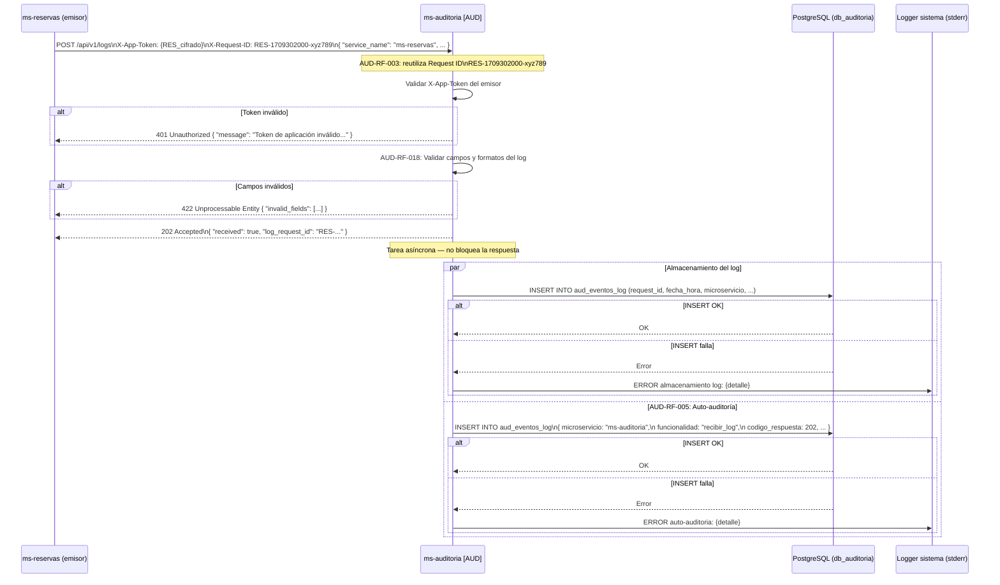

**Descripción narrativa:** El microservicio emisor envía el log con su token de aplicación y su propio Request ID. `ms-auditoria` reutiliza ese Request ID, valida el token de aplicación para verificar la identidad del emisor, y valida los campos del log (tipos, formatos y rangos según AUD-RF-018). Si alguna validación falla, responde síncronamente con el error correspondiente. Si todo es válido, responde inmediatamente con `202 Accepted` antes de que el log sea persistido. En paralelo, despacha dos tareas asíncronas: persistir el log del emisor y persistir el log de auto-auditoría de la propia operación. Los fallos de estas tareas se registran en stderr pero no afectan la respuesta ya entregada.

---

### 5.2 POST /api/v1/logs/batch — Recibir lote de logs

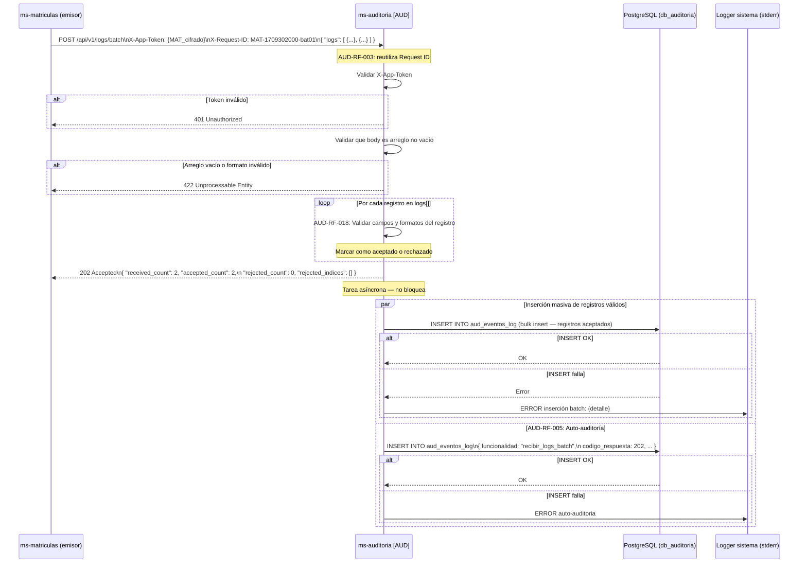

**Descripción narrativa:** Similar al flujo individual pero con validación iterativa de cada registro del lote. `ms-auditoria` valida el token, verifica que el body sea un arreglo JSON válido y no vacío, y valida cada registro individualmente. Los registros con errores se marcan como rechazados con índice y motivo; los válidos se marcan como aceptados. El servicio responde de inmediato con el resumen (cuántos aceptados y rechazados) antes de persistir. La inserción masiva de los registros aceptados ocurre en segundo plano.

---

### 5.3 GET /api/v1/logs/trace/{request_id} — Consultar traza

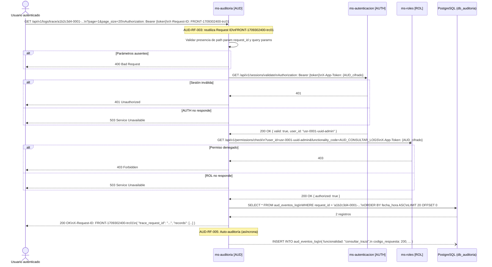

**Descripción narrativa:** El usuario envía la petición con el `request_id` de la traza que quiere reconstruir. `ms-auditoria` valida la presencia del path param y parámetros de paginación. Luego valida la sesión contra `ms-autenticacion` y los permisos contra `ms-roles` de forma síncrona. Con ambas validaciones exitosas, consulta `aud_eventos_log` filtrando por `request_id` y ordenando ascendentemente por `fecha_hora` para reconstruir la secuencia cronológica. Retorna los resultados paginados y, de forma asíncrona, registra la operación en auto-auditoría.

---

### 5.4 GET /api/v1/logs — Filtrar registros de log

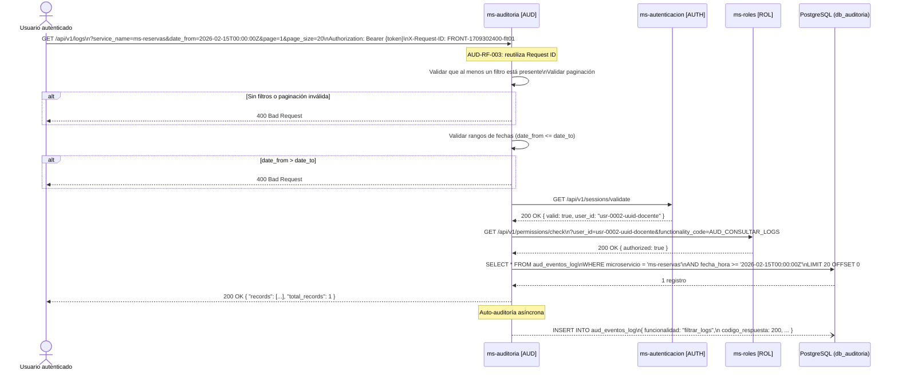

**Descripción narrativa:** El usuario proporciona al menos un criterio de filtro. `ms-auditoria` valida la presencia de al menos un filtro, la coherencia del rango de fechas y la paginación obligatoria antes de proceder con las validaciones de autenticación y permisos. La consulta a base de datos aplica los filtros recibidos como condiciones AND. Si no hay resultados, retorna lista vacía con código `200`. Auto-auditoría asíncrona al finalizar.

---

### 5.5 GET /api/v1/retention-config — Consultar configuración de retención

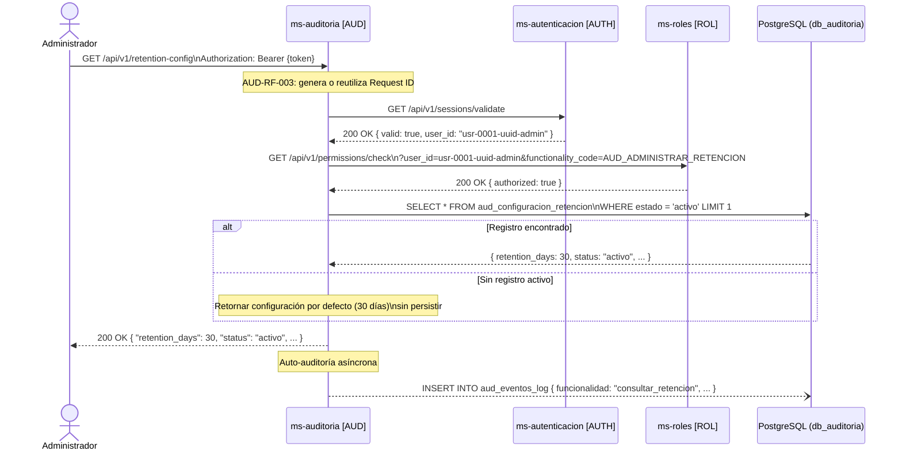

**Descripción narrativa:** Flujo estándar de consulta con sesión y permisos. Si no existe configuración activa en base de datos (primer uso), se retorna la configuración por defecto de 30 días sin persistir. La respuesta incluye los campos del registro activo de `aud_configuracion_retencion`.

---

### 5.6 PATCH /api/v1/retention-config — Actualizar configuración de retención

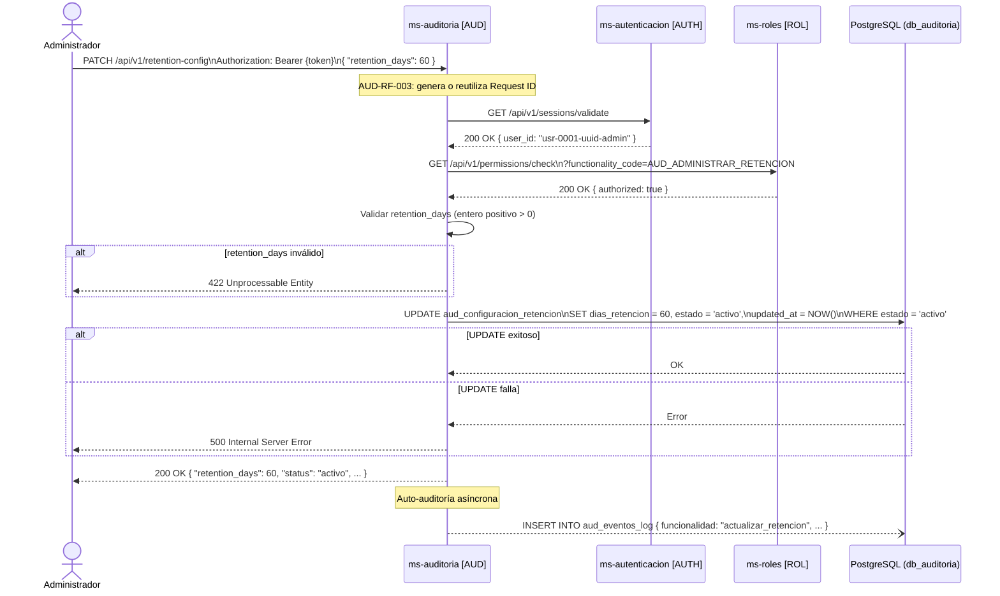

**Descripción narrativa:** El administrador envía el nuevo valor de `retention_days`. Tras validar sesión y permisos, `ms-auditoria` valida que el valor sea un entero positivo mayor a cero. Actualiza el registro activo en `aud_configuracion_retencion` y retorna la configuración resultante. Los errores de base de datos retornan `500` sin actualizar la fecha de última rotación.

---

### 5.7 POST /api/v1/retention-config/rotate — Rotación manual

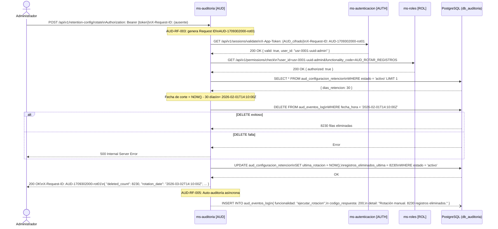

**Descripción narrativa:** El flujo más complejo del servicio. El administrador envía una petición sin cuerpo. `ms-auditoria` genera un nuevo Request ID (no viene en el header), valida la sesión y el permiso `AUD_ROTAR_REGISTROS`. Consulta la configuración activa para determinar la fecha de corte, elimina todos los registros anteriores a esa fecha de `aud_eventos_log`, actualiza el registro de configuración con la fecha y cantidad de la rotación, y retorna el resumen al administrador. La auto-auditoría de la operación de rotación se escribe en segundo plano.

---

### 5.8 GET /api/v1/retention-config/rotation-history — Historial de rotaciones

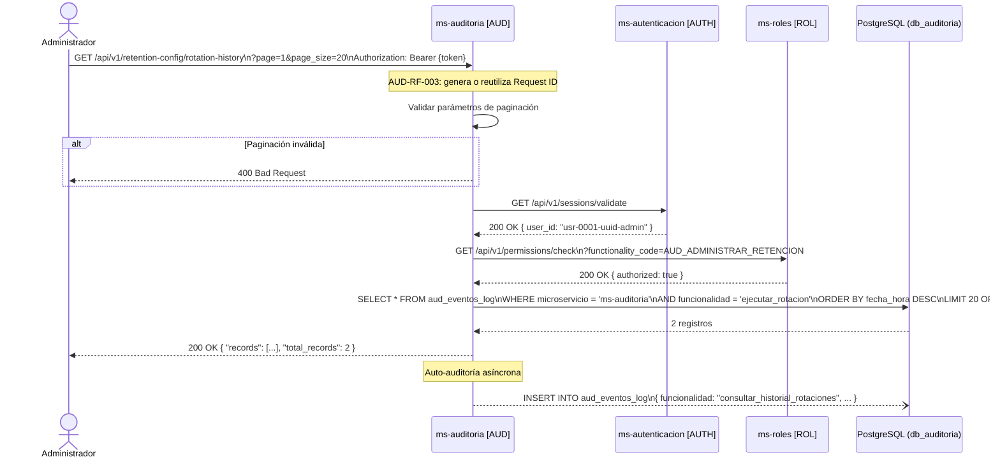

**Descripción narrativa:** El historial de rotaciones se reconstruye consultando los registros de auto-auditoría del propio servicio, filtrando por `microservicio = 'ms-auditoria'` y `funcionalidad = 'ejecutar_rotacion'`. Los resultados se ordenan por fecha descendente para mostrar las rotaciones más recientes primero. Admite filtro opcional por rango de fechas para acotar el historial.

---

### 5.9 GET /api/v1/stats — Estadísticas generales

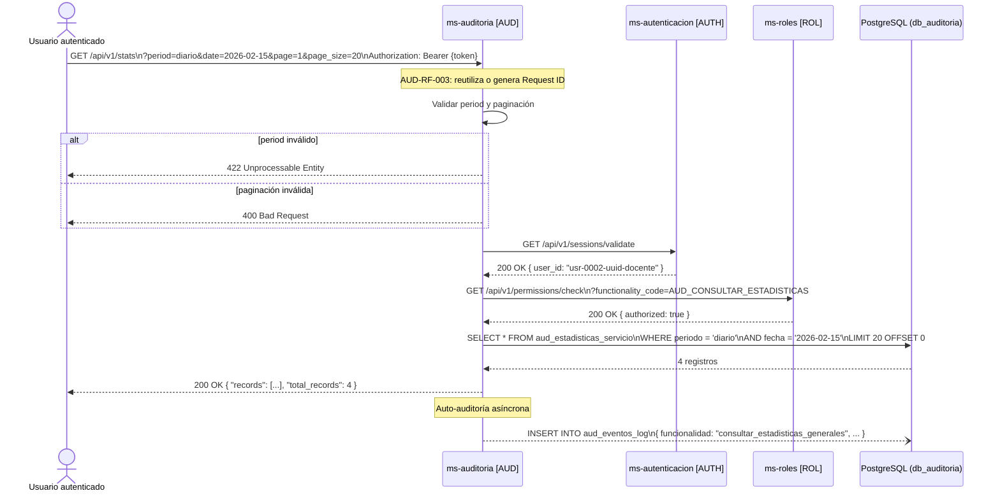

**Descripción narrativa:** El usuario especifica el periodo de análisis (diario, semanal o mensual) y opcionalmente una fecha de inicio del periodo. `ms-auditoria` valida los parámetros antes de las llamadas a servicios externos, lo que permite retornar errores de validación rápidamente sin consumir los servicios de autenticación. Consulta `aud_estadisticas_servicio` filtrada por `periodo` (y opcionalmente por `fecha`) y retorna todos los registros de todos los servicios para ese periodo, paginados.

---

### 5.10 GET /api/v1/stats/{service_name} — Estadísticas por servicio

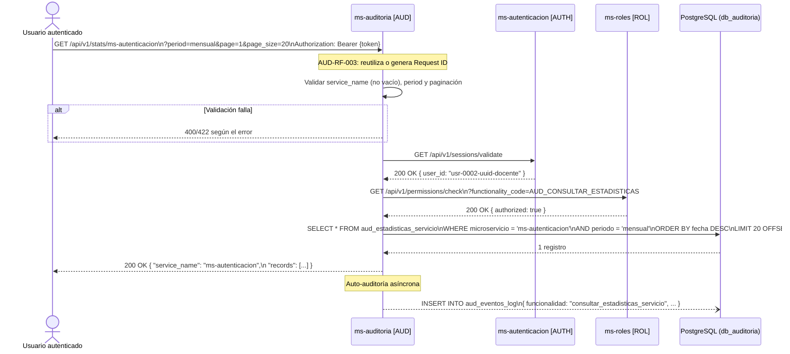

**Descripción narrativa:** Similar al endpoint de estadísticas generales pero filtrando por un `service_name` específico obtenido del path. Si el servicio no tiene estadísticas para el periodo solicitado, se retorna lista vacía con `200 OK`. Los resultados se ordenan por `fecha` descendente para mostrar los datos más recientes primero.

---

### 5.11 GET /api/v1/health — Health check

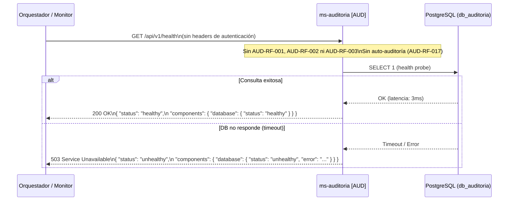

**Descripción narrativa:** Endpoint mínimo sin autenticación ni auto-auditoría. El orquestador (Kubernetes liveness/readiness probe, Nagios, pipeline CI/CD) envía una petición GET. `ms-auditoria` ejecuta una consulta mínima (`SELECT 1`) contra PostgreSQL para verificar la conectividad. Si la base de datos responde, retorna `200 healthy`; si hay timeout o error de conexión, retorna `503 unhealthy` con detalle del componente fallido. Este endpoint no genera registros de auto-auditoría para evitar ruido en los logs por los sondeos frecuentes.

---

*Documento generado a partir de: `AUD-requisitos-funcionales.md`, `modelo-datos-ms-auditoria.md` y `AUD-diseno-integracion.md` — ERP Universitario v1.0.*  
*Fecha de generación: Marzo 2026.*
