# Diagramas UML — ms-auditoria (Microservicio #19)

> **Versión:** 1.0.0 — Implementación Final  
> **Última actualización:** Junio 2025  
> **Todos los diagramas están en sintaxis Mermaid** (pegables en [Mermaid Live Editor](https://mermaid.live))

---

## Tabla de Contenidos

1. [Diagrama de Casos de Uso](#1-diagrama-de-casos-de-uso)
2. [Diagrama de Clases](#2-diagrama-de-clases)
3. [Diagramas de Secuencia](#3-diagramas-de-secuencia)
4. [Diagrama de Componentes](#4-diagrama-de-componentes)
5. [Diagrama Entidad-Relación (ER)](#5-diagrama-entidad-relación-er)
6. [Diagrama de Despliegue](#6-diagrama-de-despliegue)

---

## 1. Diagrama de Casos de Uso

### 1.1 Actores del Sistema

| Actor | Tipo | Descripción |
|-------|------|-------------|
| **Microservicio Externo** | Sistema | Cualquiera de los 18+ microservicios del ERP. Envía logs con autenticación `X-App-Token` |
| **Administrador** | Persona | Usuario con permisos de auditoría. Usa `Bearer token` + códigos de permiso |
| **Scheduler (Retención)** | Sistema | Tarea de background que ejecuta rotación automática diaria a hora configurable (`RETENTION_CRON_HOUR`) |
| **Scheduler (Estadísticas)** | Sistema | Tarea de background que recalcula estadísticas diarias a las 00:05 UTC |
| **ms-autenticacion** | Sistema | Servicio externo que valida tokens de sesión (`GET /sessions/validate`) |
| **ms-roles-permisos** | Sistema | Servicio externo que verifica permisos (`GET /permissions/check`) |
| **Orquestador (Docker/K8s)** | Sistema | Invoca el health check para verificar disponibilidad |

### 1.2 Casos de Uso

| ID | Caso de Uso | Actor Principal | Endpoint |
|----|-------------|-----------------|----------|
| CU-01 | Recibir log individual | Microservicio Externo | `POST /api/v1/logs` |
| CU-02 | Recibir logs en lote | Microservicio Externo | `POST /api/v1/logs/batch` |
| CU-03 | Consultar traza por Request ID | Administrador | `GET /api/v1/logs/trace/{request_id}` |
| CU-04 | Filtrar registros de log | Administrador | `GET /api/v1/logs` |
| CU-05 | Consultar configuración de retención | Administrador | `GET /api/v1/retention-config` |
| CU-06 | Actualizar días de retención | Administrador | `PATCH /api/v1/retention-config` |
| CU-07 | Ejecutar rotación manual | Administrador | `POST /api/v1/retention-config/rotate` |
| CU-08 | Consultar historial de rotaciones | Administrador | `GET /api/v1/retention-config/rotation-history` |
| CU-09 | Consultar estadísticas generales | Administrador | `GET /api/v1/stats` |
| CU-10 | Consultar estadísticas por servicio | Administrador | `GET /api/v1/stats/{service_name}` |
| CU-11 | Verificar salud del servicio | Orquestador | `GET /api/v1/health` |
| CU-12 | Consultar información del servicio | Cualquiera | `GET /` |

### 1.3 Diagrama Mermaid — Casos de Uso

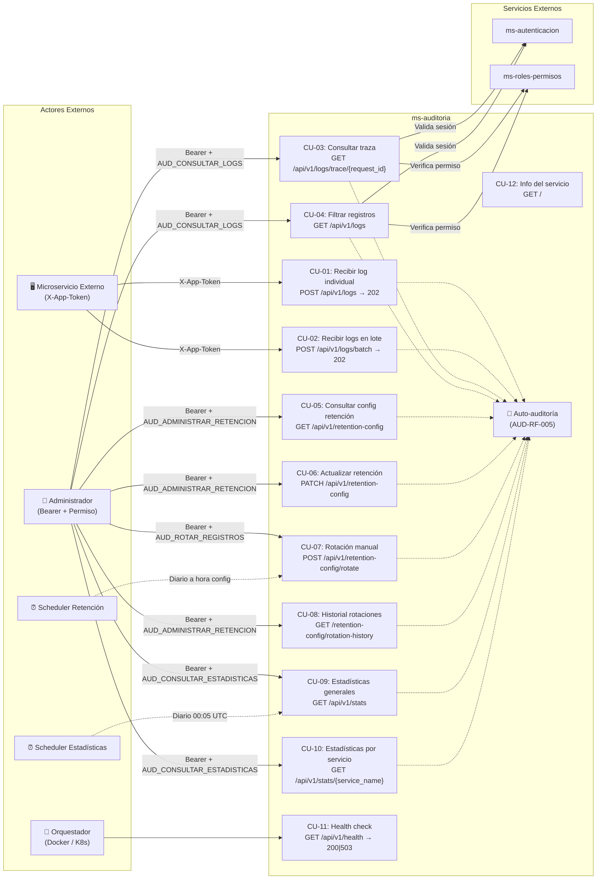

---

## 2. Diagrama de Clases

### 2.1 Diagrama de Clases Completo

```mermaid
classDiagram
    direction TB

    %% ── CAPA DE PRESENTACIÓN (Routers) ──
    class log_router {
        <<APIRouter>>
        +prefix: /api/v1/logs
        +receive_log(LogCreate) APIResponse~LogReceivedData~
        +receive_log_batch(LogBatchRequest) APIResponse~BatchReceivedData~
        +get_trace(request_id, page, page_size) APIResponse~TraceData~
        +filter_logs(page, page_size, service_name?, date_from?, date_to?) APIResponse~FilteredLogsData~
    }

    class retention_router {
        <<APIRouter>>
        +prefix: /api/v1/retention-config
        +get_retention_config() APIResponse~RetentionConfigData~
        +update_retention_config(RetentionUpdateRequest) APIResponse~RetentionConfigUpdatedData~
        +manual_rotation() APIResponse~RotationResultData~
        +get_rotation_history(page, page_size) APIResponse~RotationHistoryData~
    }

    class stats_router {
        <<APIRouter>>
        +prefix: /api/v1/stats
        +get_general_stats(period, page, page_size, date?) APIResponse~GeneralStatsData~
        +get_service_stats(service_name, period, page, page_size) APIResponse~ServiceStatsData~
    }

    class system_router {
        <<APIRouter>>
        +prefix: /api/v1
        +health_check() HealthResponse | JSONResponse 503
    }

    %% ── CAPA DE SERVICIOS ──
    class AuditService {
        -db: AsyncSession
        +__init__(db: AsyncSession)
        +enqueue_log(data: LogCreate) void
        +enqueue_batch(logs: List~LogCreate~) void
        +get_trace(request_id, page, page_size) Tuple~list, int~
        +get_filtered_logs(page, page_size, filters...) Tuple~list, int~
        +get_rotation_history(page, page_size, date_from?, date_to?) Tuple~list, int~
    }

    class RetentionService {
        -db: AsyncSession
        +__init__(db: AsyncSession)
        +get_config() dict
        +update_config(days: int) dict
        +rotate() dict
    }

    class RetentionScheduler {
        -_running: bool
        -_task: asyncio.Task
        +start() void
        +stop() void
        -_scheduler_loop() void
        -_seconds_until_next_run() int
    }

    class StatisticsService {
        -db: AsyncSession
        +__init__(db: AsyncSession)
        +get_general_stats(period, target_date?, page, page_size) Tuple~list, int~
        +get_service_stats(service_name, period, target_date?, page, page_size) Tuple~list, int~
    }

    class StatisticsScheduler {
        -_running: bool
        -_task: asyncio.Task
        +start() void
        +stop() void
        -_scheduler_loop() void
        -_calculate_daily_stats() void
    }

    class AuthService {
        <<module: services/auth_service>>
        +validate_session(token, request_id) dict | None
        +check_permission(user_id, code, request_id) bool
    }

    class ExternalServiceUnavailable {
        <<exception>>
        +service_name: str
        +detail: str
    }

    class SelfAuditService {
        <<module: services/self_audit_service>>
        +fire_self_audit(request_id, funcionalidad, metodo, codigo, duracion, ...) void
    }

    %% ── CAPA DE REPOSITORIOS ──
    class AuditRepository {
        -db: AsyncSession
        +__init__(db: AsyncSession)
        +save(log: AuditLog) AuditLog
        +save_batch(logs: List~AuditLog~) void
        +find_by_request_id(rid, page, page_size) Tuple~list, int~
        +find_filtered(page, page_size, filters...) Tuple~list, int~
        +find_rotation_history(page, page_size, dates...) Tuple~list, int~
        +delete_before(cutoff: datetime) int
    }

    class RetentionRepository {
        -db: AsyncSession
        +__init__(db: AsyncSession)
        +get_active_config() RetentionConfig | None
        +save_config(config: RetentionConfig) RetentionConfig
    }

    class StatisticsRepository {
        -db: AsyncSession
        +__init__(db: AsyncSession)
        +get_general(period, date?, page, size) Tuple~list, int~
        +get_by_service(name, period, date?, page, size) Tuple~list, int~
        +upsert_daily_stats(service, date, data) void
    }

    %% ── CAPA DE DOMINIO (Modelos ORM) ──
    class AuditLog {
        <<entity: aud_eventos_log>>
        +id: BIGSERIAL [PK]
        +request_id: VARCHAR(36)
        +fecha_hora: TIMESTAMP(tz)
        +microservicio: VARCHAR(50)
        +funcionalidad: VARCHAR(100)
        +metodo: VARCHAR(10)
        +codigo_respuesta: INTEGER
        +duracion_ms: INTEGER
        +usuario_id: VARCHAR(36)?
        +detalle: TEXT?
        +created_at: TIMESTAMP(tz)
        +updated_at: TIMESTAMP(tz)
    }

    class RetentionConfig {
        <<entity: aud_configuracion_retencion>>
        +id: SERIAL [PK]
        +dias_retencion: INTEGER
        +estado: VARCHAR(20)
        +ultima_rotacion: TIMESTAMP(tz)?
        +registros_eliminados_ultima: BIGINT?
        +created_at: TIMESTAMP(tz)
        +updated_at: TIMESTAMP(tz)
    }

    class ServiceStatistics {
        <<entity: aud_estadisticas_servicio>>
        +id: BIGSERIAL [PK]
        +microservicio: VARCHAR(50)
        +periodo: VARCHAR(10)
        +fecha: DATE
        +total_peticiones: BIGINT
        +total_errores: BIGINT
        +tiempo_promedio_ms: NUMERIC(10,2)
        +funcionalidad_top: VARCHAR(100)?
        +fecha_calculo: TIMESTAMP(tz)
        +created_at: TIMESTAMP(tz)
        +updated_at: TIMESTAMP(tz)
    }

    class MicroserviceToken {
        <<entity: microservice_tokens>>
        +id: SERIAL [PK]
        +nombre_microservicio: VARCHAR(50) [UNIQUE]
        +token_hash: VARCHAR(256)
        +activo: BOOLEAN
        +created_at: TIMESTAMP(tz)
        +updated_at: TIMESTAMP(tz)
    }

    %% ── CAPA CORE ──
    class RequestIDMiddleware {
        <<middleware>>
        +dispatch(request, call_next) Response
        -generate_request_id() str "AUD-{ts_ms}-{6char}"
    }

    class RateLimitMiddleware {
        <<middleware>>
        +dispatch(request, call_next) Response
    }

    class verify_app_token {
        <<dependency: core/auth>>
        +__call__(X_App_Token: str, db: AsyncSession) MicroserviceToken
    }

    class get_current_user {
        <<dependency>>
        +__call__(Authorization: str, request: Request) dict
    }

    class require_permission {
        <<dependency factory>>
        +__call__(permission_code: str) Callable
    }

    %% ── SCHEMAS ──
    class LogCreate {
        <<schema>>
        +timestamp: datetime
        +request_id: str?
        +service_name: str
        +functionality: str
        +method: str
        +response_code: int
        +duration_ms: int
        +user_id: str?
        +detail: str?
    }

    class LogRecord {
        <<schema>>
        +id: int
        +timestamp: datetime [alias: fecha_hora]
        +service_name: str [alias: microservicio]
        +functionality: str [alias: funcionalidad]
        +method: str [alias: metodo]
        +response_code: int [alias: codigo_respuesta]
        +duration_ms: int [alias: duracion_ms]
        +user_id: str? [alias: usuario_id]
        +detail: str? [alias: detalle]
    }

    class APIResponse~T~ {
        <<schema>>
        +request_id: str
        +success: bool
        +data: T?
        +message: str
        +timestamp: datetime
    }

    %% ── RELACIONES ──
    log_router --> AuditService : usa
    log_router --> verify_app_token : Depends (POST)
    log_router --> require_permission : Depends (GET)
    retention_router --> RetentionService : usa
    retention_router --> AuditService : usa (rotation-history)
    retention_router --> require_permission : Depends
    stats_router --> StatisticsService : usa
    stats_router --> require_permission : Depends
    system_router ..> AuditLog : health check (SELECT 1)

    AuditService --> AuditRepository : usa
    RetentionService --> RetentionRepository : usa
    RetentionService --> AuditRepository : usa (delete)
    StatisticsService --> StatisticsRepository : usa

    AuditRepository --> AuditLog : opera sobre
    RetentionRepository --> RetentionConfig : opera sobre
    StatisticsRepository --> ServiceStatistics : opera sobre
    verify_app_token --> MicroserviceToken : consulta

    require_permission --> get_current_user : Depends
    get_current_user --> AuthService : valida sesión
    require_permission --> AuthService : verifica permiso
    AuthService --> ExternalServiceUnavailable : lanza en timeout/error

    SelfAuditService ..> AuditRepository : registra auto-log (background)

    RetentionScheduler --> RetentionService : ejecuta purga
    StatisticsScheduler --> StatisticsService : calcula métricas

    log_router ..> LogCreate : valida entrada
    log_router ..> LogRecord : serializa salida
    log_router ..> APIResponse : envuelve respuesta
```

### 2.2 Tabla de Relaciones

| Clase Origen | Relación | Clase Destino | Cardinalidad | Descripción |
|---|---|---|---|---|
| `log_router` | usa | `AuditService` | 1 → 1 | Endpoints POST y GET de logs |
| `log_router` | depends | `verify_app_token` | 1 → 1 | POST requiere X-App-Token |
| `log_router` | depends | `require_permission` | 1 → 1 | GET requiere Bearer + permiso |
| `retention_router` | usa | `RetentionService` | 1 → 1 | Config y rotación |
| `retention_router` | usa | `AuditService` | 1 → 1 | Historial de rotaciones |
| `stats_router` | usa | `StatisticsService` | 1 → 1 | Estadísticas precalculadas |
| `require_permission` | depends | `get_current_user` | 1 → 1 | Primero valida sesión |
| `get_current_user` | llama | `AuthService.validate_session()` | 1 → 1 | HTTP a ms-autenticacion, timeout 3s |
| `require_permission` | llama | `AuthService.check_permission()` | 1 → 1 | HTTP a ms-roles, timeout 3s |
| `AuditService` | usa | `AuditRepository` | 1 → 1 | Composición |
| `RetentionService` | usa | `RetentionRepository` | 1 → 1 | Composición |
| `RetentionService` | usa | `AuditRepository` | 1 → 1 | Para DELETE masivo |
| `StatisticsService` | usa | `StatisticsRepository` | 1 → 1 | Composición |
| `AuditRepository` | opera sobre | `AuditLog` | 1 → * | CRUD sobre tabla aud_eventos_log |
| `RetentionRepository` | opera sobre | `RetentionConfig` | 1 → 1 | Singleton (config única activa) |
| `StatisticsRepository` | opera sobre | `ServiceStatistics` | 1 → * | Métricas precalculadas |
| `verify_app_token` | consulta | `MicroserviceToken` | 1 → 0..1 | Busca token activo por SHA-256 hash |
| `SelfAuditService` | inserta | `AuditLog` | 1 → 1 | Auto-auditoría AUD-RF-005 en background (asyncio.create_task) |
| `RetentionScheduler` | ejecuta | `RetentionService.rotate()` | 1 → 1 | Purga diaria a hora config |
| `StatisticsScheduler` | ejecuta | `StatisticsService` | 1 → 1 | Cálculo diario a 00:05 UTC |

---

## 3. Diagramas de Secuencia

### 3.1 Secuencia: Recibir Log Individual (POST /api/v1/logs) — 202 Accepted

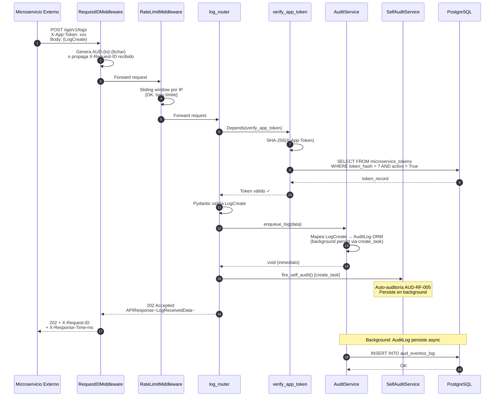

### 3.2 Secuencia: Consultar Logs con Filtros (GET /api/v1/logs) — Autenticación Completa

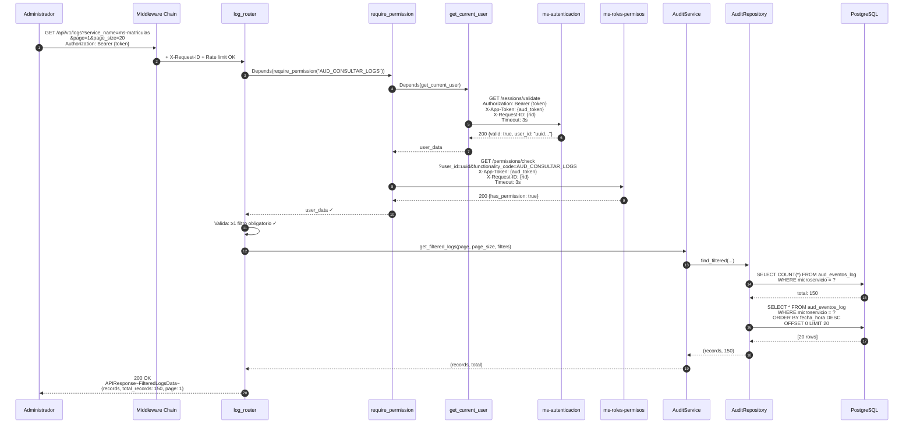

### 3.3 Secuencia: Manejo de Servicio Externo No Disponible (HTTP 503)

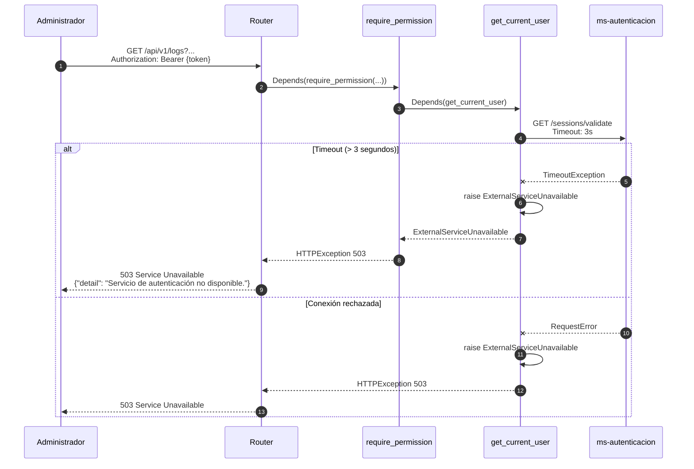

### 3.4 Secuencia: Rotación Automática (RetentionScheduler)

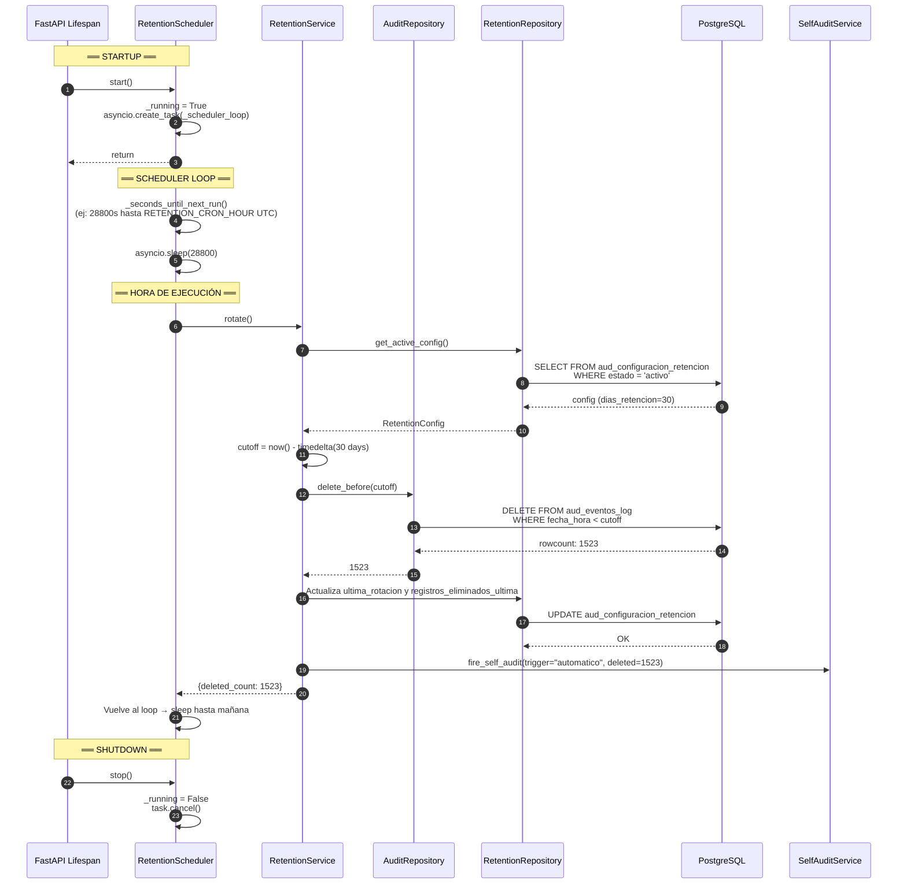

### 3.5 Secuencia: Cálculo de Estadísticas (StatisticsScheduler)

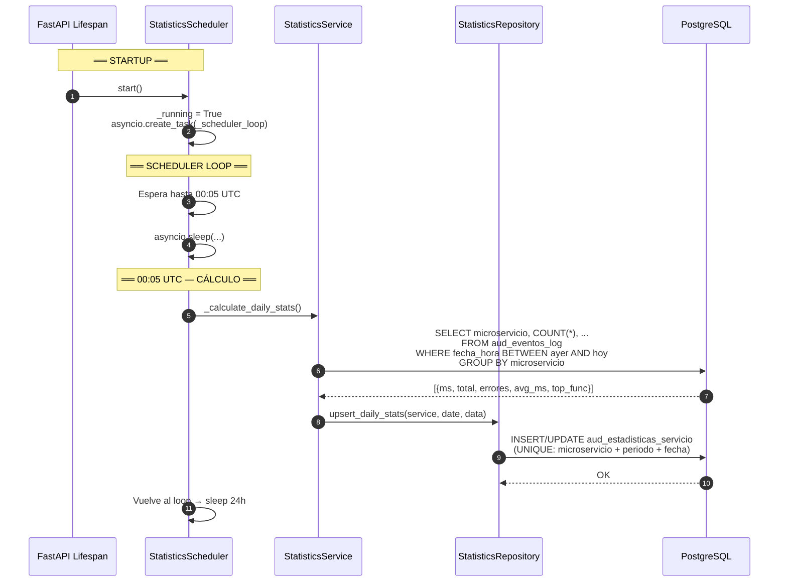

### 3.6 Secuencia: Health Check (GET /api/v1/health)

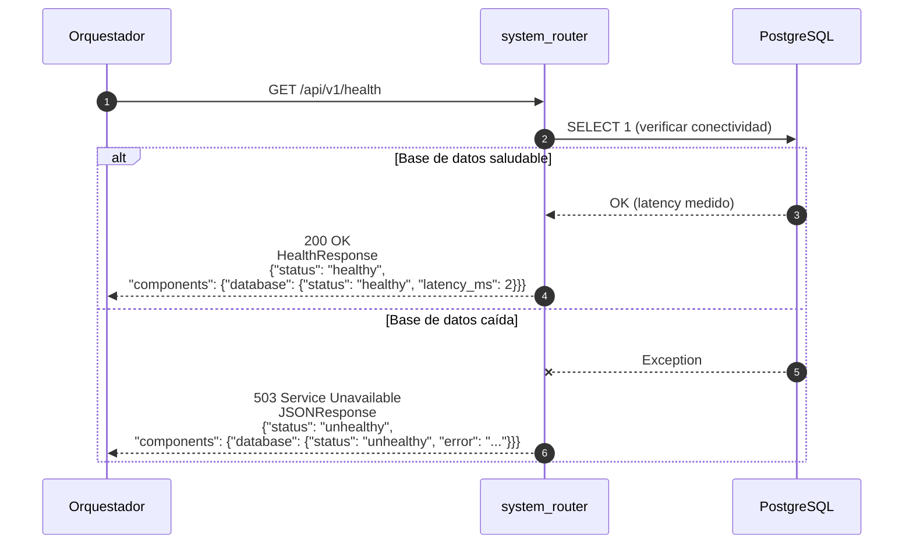

### 3.7 Secuencia: Validación de X-App-Token (Detalle)

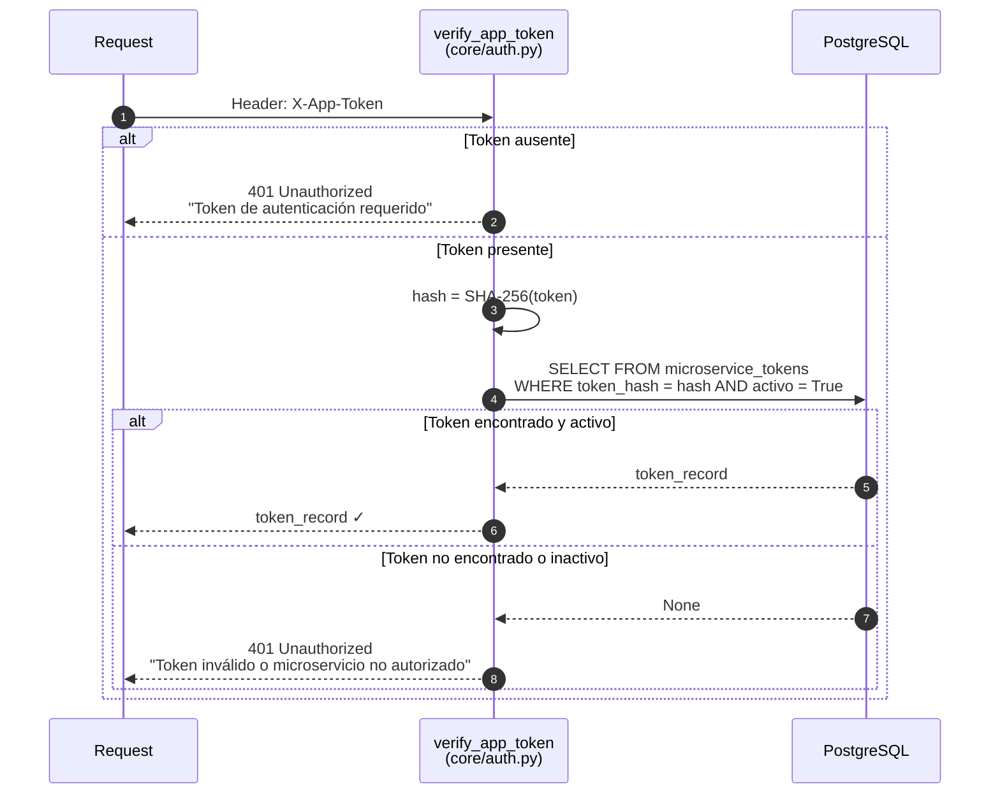

---

## 4. Diagrama de Componentes

### 4.1 Arquitectura Interna por Capas

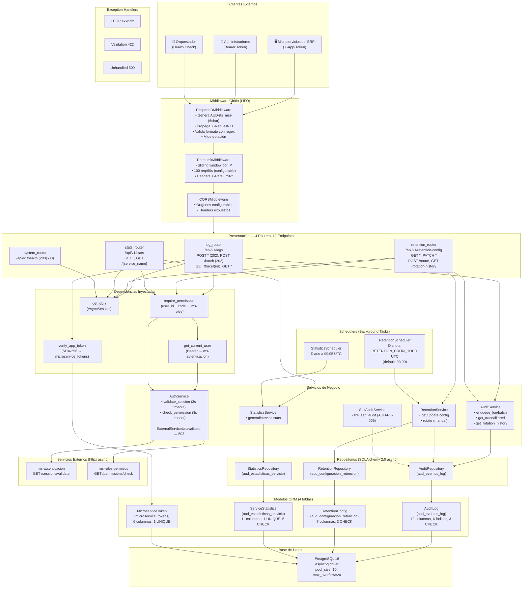

### 4.2 Diagrama Simplificado por Capas

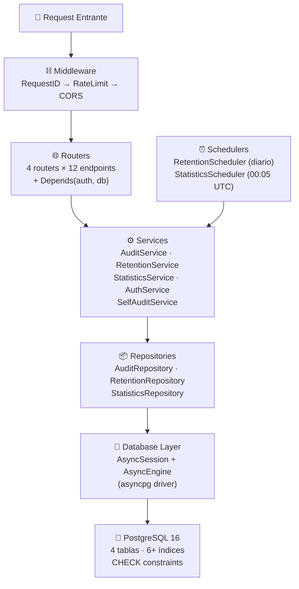

---

## 5. Diagrama Entidad-Relación (ER)

### 5.1 Diagrama ER Completo

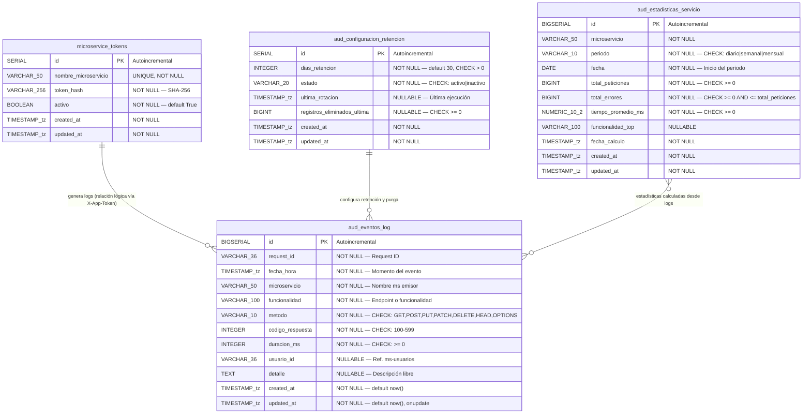

### 5.2 Detalle de Índices

| # | Nombre | Tabla | Tipo | Columna(s) | Propósito |
|---|--------|-------|------|------------|-----------|
| 1 | PK (id) | aud_eventos_log | B-Tree (PK) | id | Clave primaria |
| 2 | `idx_aud_eventos_request_id` | aud_eventos_log | B-Tree | request_id | Trazabilidad por X-Request-ID |
| 3 | `idx_aud_eventos_microservicio` | aud_eventos_log | B-Tree | microservicio | Filtro por servicio |
| 4 | `idx_aud_eventos_fecha_hora` | aud_eventos_log | B-Tree | fecha_hora | Filtro por rango de fechas |
| 5 | `idx_aud_eventos_microservicio_fecha` | aud_eventos_log | B-Tree (compuesto) | microservicio, fecha_hora | Filtro servicio + rango temporal |
| 6 | `idx_aud_eventos_codigo_respuesta` | aud_eventos_log | B-Tree | codigo_respuesta | Filtro por código HTTP |
| 7 | `idx_aud_eventos_usuario_id` | aud_eventos_log | B-Tree (parcial) | usuario_id WHERE IS NOT NULL | Filtro por usuario (sin indexar NULLs) |
| 8 | PK (id) | aud_configuracion_retencion | B-Tree (PK) | id | Clave primaria |
| 9 | PK (id) | aud_estadisticas_servicio | B-Tree (PK) | id | Clave primaria |
| 10 | `uq_aud_estad_ms_periodo_fecha` | aud_estadisticas_servicio | B-Tree (UNIQUE) | microservicio, periodo, fecha | Unicidad por servicio+periodo+fecha |
| 11 | PK (id) | microservice_tokens | B-Tree (PK) | id | Clave primaria |
| 12 | UQ (nombre) | microservice_tokens | B-Tree (UNIQUE) | nombre_microservicio | Unicidad de nombre |

### 5.3 Detalle de CHECK Constraints

| Tabla | Nombre | Expresión |
|-------|--------|-----------|
| aud_eventos_log | `chk_aud_eventos_metodo` | `metodo IN ('GET','POST','PUT','PATCH','DELETE','HEAD','OPTIONS')` |
| aud_eventos_log | `chk_aud_eventos_codigo` | `codigo_respuesta BETWEEN 100 AND 599` |
| aud_eventos_log | `chk_aud_eventos_duracion` | `duracion_ms >= 0` |
| aud_configuracion_retencion | `chk_aud_config_dias` | `dias_retencion > 0` |
| aud_configuracion_retencion | `chk_aud_config_estado` | `estado IN ('activo', 'inactivo')` |
| aud_configuracion_retencion | `chk_aud_config_registros` | `registros_eliminados_ultima >= 0` |
| aud_estadisticas_servicio | `chk_aud_estad_periodo` | `periodo IN ('diario', 'semanal', 'mensual')` |
| aud_estadisticas_servicio | `chk_aud_estad_peticiones` | `total_peticiones >= 0` |
| aud_estadisticas_servicio | `chk_aud_estad_errores` | `total_errores >= 0` |
| aud_estadisticas_servicio | `chk_aud_estad_errores_max` | `total_errores <= total_peticiones` |
| aud_estadisticas_servicio | `chk_aud_estad_tiempo` | `tiempo_promedio_ms >= 0` |

### 5.4 Nota sobre Relaciones

Las tablas **no tienen Foreign Keys** entre sí por diseño:

- `aud_eventos_log.microservicio` → `microservice_tokens.nombre_microservicio`: Relación lógica validada en runtime vía X-App-Token. Los logs pueden existir independientemente de los tokens, facilitando la purga masiva sin restricciones de FK.
- `aud_estadisticas_servicio.microservicio` → Corresponde lógicamente a los servicios registrados, pero las estadísticas se calculan por aggregation de `aud_eventos_log`.
- `aud_configuracion_retencion` opera como singleton (una única fila activa) que configura la purga de `aud_eventos_log`.

---

## 6. Diagrama de Despliegue

### 6.1 Docker Compose — Arquitectura de Contenedores

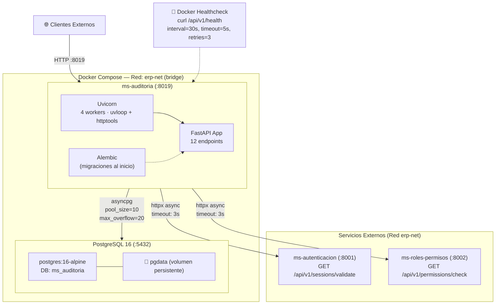

### 6.2 Lifecycle de la Aplicación

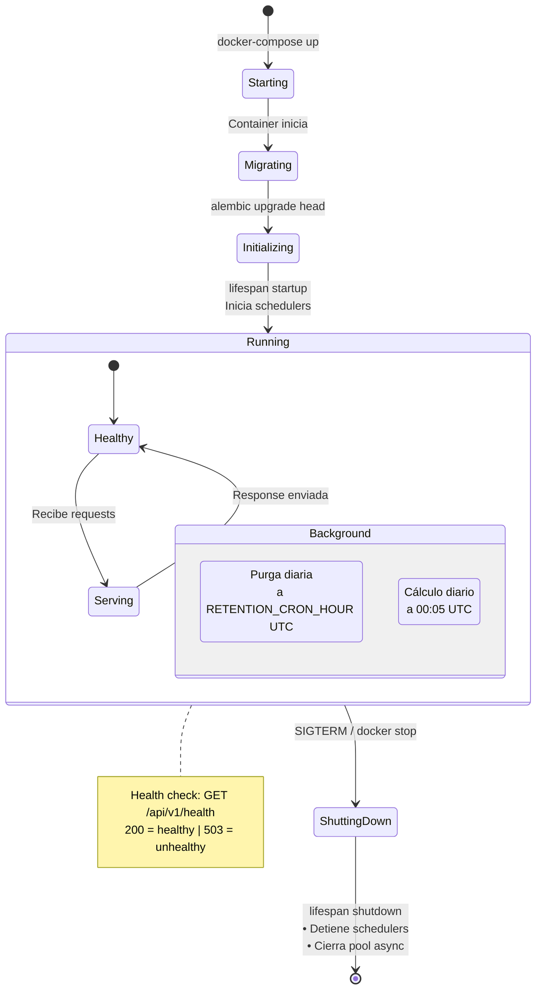

---

## Apéndice: Resumen de Endpoints (12 totales)

| # | Método | Ruta | Auth | Permiso | Código Éxito | Descripción |
|---|--------|------|------|---------|:------------:|-------------|
| 1 | POST | `/api/v1/logs` | X-App-Token | — | 202 | Recibir log individual |
| 2 | POST | `/api/v1/logs/batch` | X-App-Token | — | 202 | Recibir lote (1-1000) |
| 3 | GET | `/api/v1/logs/trace/{request_id}` | Bearer | AUD_CONSULTAR_LOGS | 200 | Traza por request_id |
| 4 | GET | `/api/v1/logs` | Bearer | AUD_CONSULTAR_LOGS | 200 | Filtrar (≥1 filtro requerido) |
| 5 | GET | `/api/v1/retention-config` | Bearer | AUD_ADMINISTRAR_RETENCION | 200 | Config de retención |
| 6 | PATCH | `/api/v1/retention-config` | Bearer | AUD_ADMINISTRAR_RETENCION | 200 | Actualizar días |
| 7 | POST | `/api/v1/retention-config/rotate` | Bearer | AUD_ROTAR_REGISTROS | 200 | Rotación manual |
| 8 | GET | `/api/v1/retention-config/rotation-history` | Bearer | AUD_ADMINISTRAR_RETENCION | 200 | Historial rotaciones (con campo `trigger`) |
| 9 | GET | `/api/v1/stats` | Bearer | AUD_CONSULTAR_ESTADISTICAS | 200 | Estadísticas generales |
| 10 | GET | `/api/v1/stats/{service_name}` | Bearer | AUD_CONSULTAR_ESTADISTICAS | 200 | Estadísticas por servicio |
| 11 | GET | `/api/v1/health` | Ninguna | — | 200/503 | Health check |
| 12 | GET | `/` | Ninguna | — | 200 | Info del microservicio |
