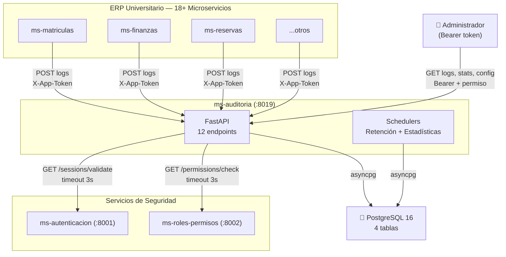
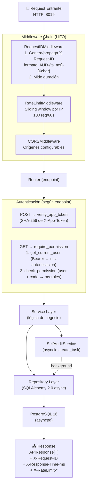
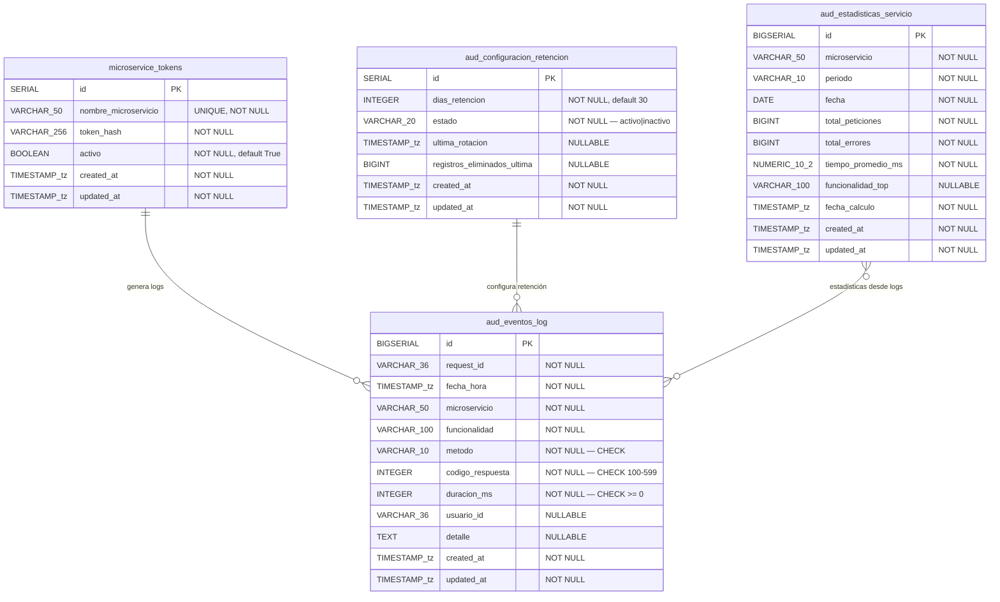
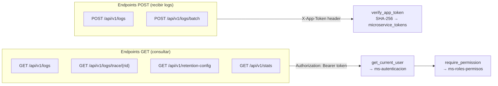
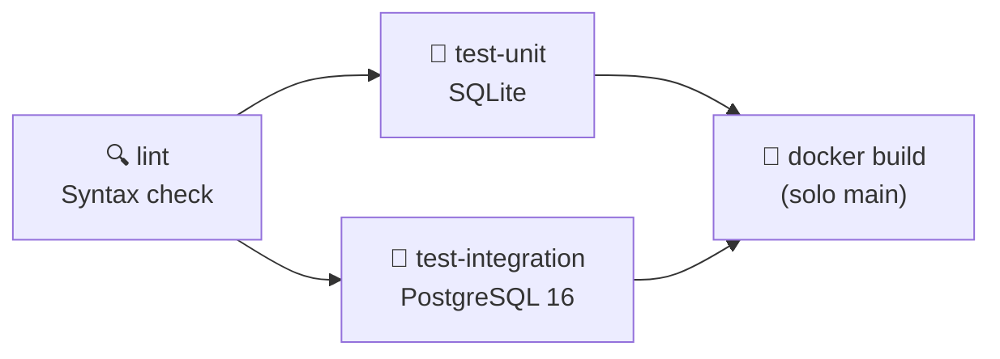
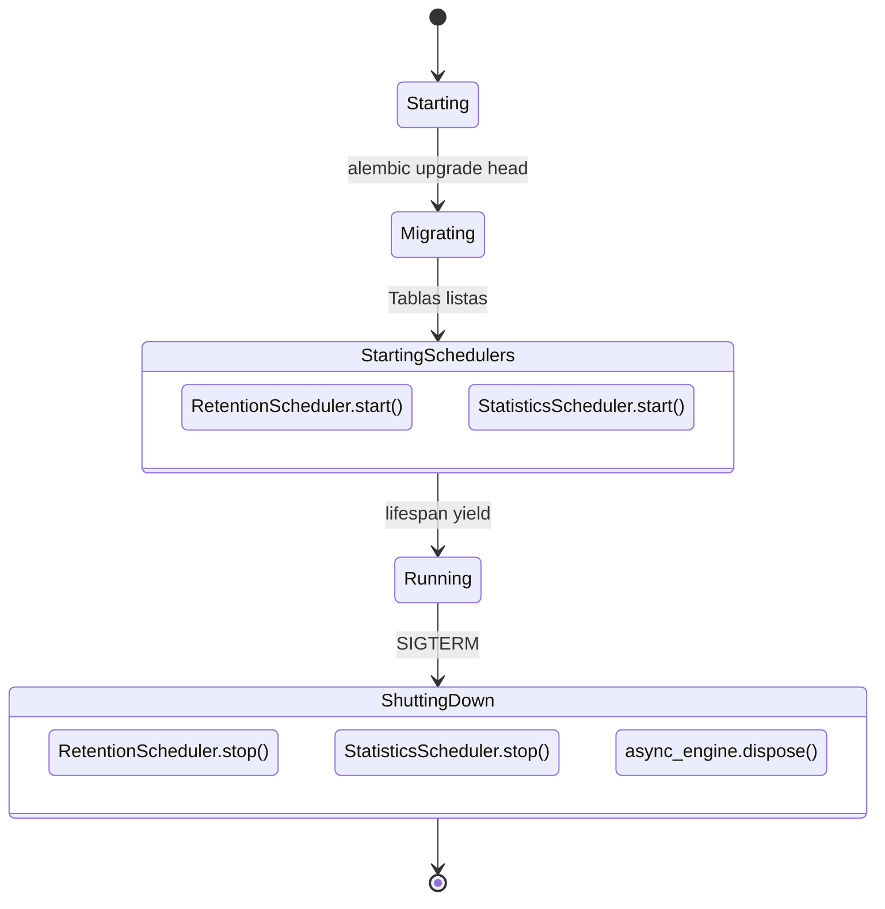

# Documento Técnico de Arquitectura — ms-auditoria (Microservicio #19)

> **Versión:** 1.0.0 — Implementación Final  
> **Última actualización:** Junio 2025  
> **Stack:** FastAPI 0.115.6 + SQLAlchemy 2.0.36 async + PostgreSQL 16 + Python 3.10

---

## Tabla de Contenidos

1. [Visión General](#1-visión-general)
2. [Stack Tecnológico](#2-stack-tecnológico)
3. [Estructura del Proyecto](#3-estructura-del-proyecto)
4. [Arquitectura de la Aplicación](#4-arquitectura-de-la-aplicación)
5. [Modelo de Datos](#5-modelo-de-datos)
6. [Seguridad](#6-seguridad)
7. [Concurrencia y Rendimiento](#7-concurrencia-y-rendimiento)
8. [Testing](#8-testing)
9. [DevOps y Despliegue](#9-devops-y-despliegue)
10. [Justificaciones Técnicas](#10-justificaciones-técnicas)

---

## 1. Visión General

### 1.1 Propósito

**ms-auditoria** es el microservicio #19 del ERP Universitario. Es responsable de registrar, almacenar, consultar y gestionar eventos de auditoría generados por los 18+ microservicios del sistema.

### 1.2 Responsabilidades Principales

- **Registro de logs**: Recibir eventos de auditoría individual y en lote (POST → 202 Accepted)
- **Trazabilidad**: Consultar la traza completa de un request distribuido por `request_id`
- **Filtrado**: Consultar logs con filtros obligatorios (servicio, fechas)
- **Retención**: Configurar días de retención, ejecutar rotación manual/automática
- **Estadísticas**: Consultar métricas precalculadas por servicio y periodo
- **Auto-auditoría**: Cada operación del propio microservicio se registra como log (AUD-RF-005)
- **Health check**: Verificar salud del servicio y conectividad a BD

### 1.3 Diagrama de Arquitectura General



---

## 2. Stack Tecnológico

| Capa | Tecnología | Versión | Propósito |
|------|-----------|---------|-----------|
| **Framework** | FastAPI | 0.115.6 | Framework web async con validación y docs automáticas |
| **Servidor** | Uvicorn | 0.34.0 | Servidor ASGI con soporte uvloop |
| **ORM** | SQLAlchemy | 2.0.36 | ORM async con select 2.0 syntax |
| **Driver BD** | asyncpg | 0.30.0 | Driver PostgreSQL nativo async |
| **Validación** | Pydantic | 2.10.3 | Validación de datos con core en Rust |
| **Configuración** | pydantic-settings | 2.7.0 | Settings desde .env y variables de entorno |
| **Migraciones** | Alembic | 1.14.0 | Migraciones de BD versionadas |
| **HTTP Client** | httpx | — | Cliente async para llamadas a ms externos |
| **Base de datos** | PostgreSQL | 16 | BD relacional con UUID nativo |
| **Tests** | pytest + pytest-asyncio | — | Framework de testing con soporte async |
| **Tests BD** | SQLite + aiosqlite | — | BD en memoria para unit tests |
| **Contenedor** | Docker | Multi-stage | Imagen optimizada con usuario no-root |
| **Orquestación** | Docker Compose | — | Stack completo con PostgreSQL |
| **Python** | CPython | 3.10 | Runtime |

---

## 3. Estructura del Proyecto

```
ms-auditoria/
├── app/
│   ├── __init__.py
│   ├── main.py                          # FastAPI app, lifespan, middleware, routers
│   │
│   ├── core/                            # Componentes transversales
│   │   ├── config.py                    # Settings (pydantic-settings, .env)
│   │   ├── middleware.py                # RequestIDMiddleware (AUD-{ts}-{6char})
│   │   ├── rate_limiter.py              # RateLimitMiddleware (sliding window)
│   │   ├── auth.py                      # verify_app_token (SHA-256)
│   │   ├── dependencies.py              # get_db, get_current_user, require_permission
│   │   ├── exception_handlers.py        # Handlers globales (4xx, 422, 500)
│   │   └── security.py                  # AESCipher (disponible, no usado en flujo principal)
│   │
│   ├── models/                          # Modelos ORM (SQLAlchemy 2.0)
│   │   ├── __init__.py
│   │   ├── audit_log.py                 # AuditLog → aud_eventos_log
│   │   ├── retention_config.py          # RetentionConfig → aud_configuracion_retencion
│   │   ├── service_statistics.py        # ServiceStatistics → aud_estadisticas_servicio
│   │   └── microservice_token.py        # MicroserviceToken → microservice_tokens
│   │
│   ├── schemas/                         # Schemas Pydantic v2
│   │   ├── audit_schema.py              # LogCreate, LogRecord, TraceData, etc.
│   │   ├── response_schema.py           # APIResponse[T], HealthResponse
│   │   ├── retention_schema.py          # RetentionConfigData, RotationResultData, etc.
│   │   └── statistics_schema.py         # StatsRecord, GeneralStatsData, etc.
│   │
│   ├── repositories/                    # Capa de acceso a datos
│   │   ├── audit_repository.py          # CRUD + filtros sobre aud_eventos_log
│   │   ├── retention_repository.py      # Config singleton en aud_configuracion_retencion
│   │   └── statistics_repository.py     # Métricas en aud_estadisticas_servicio
│   │
│   ├── services/                        # Lógica de negocio
│   │   ├── audit_service.py             # enqueue_log, get_trace, get_filtered_logs, etc.
│   │   ├── retention_service.py         # get/update config, rotate + RetentionScheduler
│   │   ├── statistics_service.py        # get_stats + StatisticsScheduler (00:05 UTC)
│   │   ├── auth_service.py              # validate_session, check_permission (httpx)
│   │   └── self_audit_service.py        # fire_self_audit (asyncio.create_task)
│   │
│   ├── routes/
│   │   └── audit_routes.py              # 4 routers × 12 endpoints
│   │
│   ├── database/                        # Infraestructura de BD
│   │   ├── base.py                      # DeclarativeBase
│   │   ├── connection.py                # async_engine, sync_engine, pool config
│   │   ├── session.py                   # AsyncSessionLocal
│   │   └── unit_of_work.py              # UnitOfWork (disponible)
│   │
│   └── utils/
│       └── logger.py                    # JSON structured logging
│
├── alembic/                             # Migraciones de BD
│   ├── env.py
│   └── versions/
│
├── tests/                               # Test suite (79 tests)
│   ├── conftest.py                      # Fixtures async + SQLite en memoria
│   ├── test_audit_routes.py
│   ├── test_retention.py
│   ├── test_statistics.py
│   ├── test_edge_cases.py
│   ├── test_security.py
│   ├── test_middleware.py
│   └── test_integration_postgres.py     # Tests con PostgreSQL real (skip sin BD)
│
├── docs/                                # Documentación
├── Dockerfile                           # Multi-stage build
├── docker-compose.yml                   # Stack completo
├── requirements.txt
├── .env.example
└── .github/workflows/ci.yml            # CI/CD pipeline
```

---

## 4. Arquitectura de la Aplicación

### 4.1 Flujo de un Request



### 4.2 Endpoints Implementados (12 totales)

| # | Método | Ruta | Función | Auth | Permiso | Código | Descripción |
|---|--------|------|---------|------|---------|:------:|-------------|
| 1 | POST | `/api/v1/logs` | `receive_log` | X-App-Token | — | 202 | Registrar log individual |
| 2 | POST | `/api/v1/logs/batch` | `receive_log_batch` | X-App-Token | — | 202 | Registrar lote (1-1000) |
| 3 | GET | `/api/v1/logs/trace/{request_id}` | `get_trace` | Bearer | AUD_CONSULTAR_LOGS | 200 | Traza por request_id |
| 4 | GET | `/api/v1/logs` | `filter_logs` | Bearer | AUD_CONSULTAR_LOGS | 200 | Filtrar (≥1 filtro obligatorio) |
| 5 | GET | `/api/v1/retention-config` | `get_retention_config` | Bearer | AUD_ADMINISTRAR_RETENCION | 200 | Config de retención |
| 6 | PATCH | `/api/v1/retention-config` | `update_retention_config` | Bearer | AUD_ADMINISTRAR_RETENCION | 200 | Actualizar días |
| 7 | POST | `/api/v1/retention-config/rotate` | `manual_rotation` | Bearer | AUD_ROTAR_REGISTROS | 200 | Rotación manual |
| 8 | GET | `/api/v1/retention-config/rotation-history` | `get_rotation_history` | Bearer | AUD_ADMINISTRAR_RETENCION | 200 | Historial (campo `trigger`: manual/automatico) |
| 9 | GET | `/api/v1/stats` | `get_general_stats` | Bearer | AUD_CONSULTAR_ESTADISTICAS | 200 | Estadísticas generales |
| 10 | GET | `/api/v1/stats/{service_name}` | `get_service_stats` | Bearer | AUD_CONSULTAR_ESTADISTICAS | 200 | Estadísticas por servicio |
| 11 | GET | `/api/v1/health` | `health_check` | Ninguna | — | 200/503 | Health check + DB latency |
| 12 | GET | `/` | `root` | Ninguna | — | 200 | Info del microservicio |

### 4.3 Routers

La aplicación usa 4 `APIRouter` independientes registrados en `main.py`:

| Router | Prefijo | Tags | Endpoints |
|--------|---------|------|-----------|
| `log_router` | `/api/v1/logs` | Eventos de Log | #1, #2, #3, #4 |
| `retention_router` | `/api/v1/retention-config` | Configuración de Retención | #5, #6, #7, #8 |
| `stats_router` | `/api/v1/stats` | Estadísticas | #9, #10 |
| `system_router` | `/api/v1` | Sistema | #11 |

El endpoint #12 (`GET /`) está definido directamente en `main.py`.

### 4.4 Cadena de Middleware

Los middlewares se registran en `main.py` en este orden:

```python
app.add_middleware(CORSMiddleware, ...)       # 3. CORS
app.add_middleware(RateLimitMiddleware)        # 2. Rate Limit
app.add_middleware(RequestIDMiddleware)        # 1. Request ID
```

Starlette ejecuta los middlewares en **orden inverso** (LIFO), por lo que el orden real es:

```
Request → RequestIDMiddleware → RateLimitMiddleware → CORSMiddleware → Endpoint
```

### 4.5 Exception Handlers Globales

Registrados en `core/exception_handlers.py`:

| Handler | Captura | Respuesta |
|---------|---------|-----------|
| `http_exception_handler` | `StarletteHTTPException` (4xx, 5xx) | JSON estandarizado `{success: false, ...}` |
| `validation_exception_handler` | `RequestValidationError` (Pydantic) | 422 con lista de errores |
| `unhandled_exception_handler` | `Exception` genérica | 500 con detalle oculto en prod |

### 4.6 Capa de Servicio

| Servicio | Archivo | Métodos | Descripción |
|----------|---------|---------|-------------|
| `AuditService` | `audit_service.py` | `enqueue_log`, `enqueue_batch`, `get_trace`, `get_filtered_logs`, `get_rotation_history` | Operaciones sobre logs |
| `RetentionService` | `retention_service.py` | `get_config`, `update_config`, `rotate` | Gestión de retención |
| `StatisticsService` | `statistics_service.py` | `get_general_stats`, `get_service_stats` | Estadísticas precalculadas |
| `AuthService` | `auth_service.py` | `validate_session`, `check_permission` | Comunicación con ms externos |
| `SelfAuditService` | `self_audit_service.py` | `fire_self_audit` | Auto-auditoría AUD-RF-005 |

### 4.7 Schedulers (Background Tasks)

| Scheduler | Hora | Frecuencia | Acción | Error Handling |
|-----------|------|------------|--------|----------------|
| `RetentionScheduler` | `RETENTION_CRON_HOUR` UTC (default: 03:00) | Diario | Purga logs > dias_retencion | Espera 1h y reintenta |
| `StatisticsScheduler` | 00:05 UTC | Diario | Calcula métricas diarias | Espera 1h y reintenta |

Ambos usan `asyncio.create_task()` + `asyncio.sleep()` sin dependencias externas. Se inician en `lifespan` startup y se detienen en shutdown.

### 4.8 Formato de Respuesta Estándar

Todos los endpoints (excepto `/health`) retornan `APIResponse[T]`:

```json
{
  "request_id": "AUD-1719834000000-abc123",
  "success": true,
  "data": { ... },
  "message": "Descripción del resultado",
  "timestamp": "2025-06-28T14:00:00.000000+00:00"
}
```

El health check retorna `HealthResponse`:

```json
{
  "status": "healthy",
  "service": "ms-auditoria",
  "version": "1.0.0",
  "components": {
    "database": {
      "status": "healthy",
      "latency_ms": 2
    }
  },
  "timestamp": "2025-06-28T14:00:00.000000+00:00"
}
```

---

## 5. Modelo de Datos

### 5.1 Diagrama ER



### 5.2 Tabla `aud_eventos_log` — Detalle de Columnas

| Columna | Tipo PostgreSQL | Tipo ORM | Nullable | Default | Comentario |
|---------|----------------|----------|----------|---------|------------|
| `id` | BIGSERIAL | BigInteger (Integer en SQLite) | NOT NULL | autoincrement | Identificador interno |
| `request_id` | VARCHAR(36) | String(36) | NOT NULL | — | ID de trazabilidad (X-Request-ID) |
| `fecha_hora` | TIMESTAMP(tz) | TIMESTAMP(timezone=True) | NOT NULL | — | Momento del evento en el ms origen |
| `microservicio` | VARCHAR(50) | String(50) | NOT NULL | — | Nombre del microservicio emisor |
| `funcionalidad` | VARCHAR(100) | String(100) | NOT NULL | — | Funcionalidad o endpoint ejecutado |
| `metodo` | VARCHAR(10) | String(10) | NOT NULL | — | Método HTTP |
| `codigo_respuesta` | INTEGER | Integer | NOT NULL | — | Código de respuesta HTTP |
| `duracion_ms` | INTEGER | Integer | NOT NULL | — | Duración en milisegundos |
| `usuario_id` | VARCHAR(36) | String(36) | NULLABLE | None | UUID del usuario (null si sistema) |
| `detalle` | TEXT | Text | NULLABLE | None | Descripción libre del contexto |
| `created_at` | TIMESTAMP(tz) | TIMESTAMP(timezone=True) | NOT NULL | `now(UTC)` | Momento de inserción |
| `updated_at` | TIMESTAMP(tz) | TIMESTAMP(timezone=True) | NOT NULL | `now(UTC)` | Última modificación |

### 5.3 Tabla `aud_configuracion_retencion` — Detalle de Columnas

| Columna | Tipo PostgreSQL | Nullable | Default | Comentario |
|---------|----------------|----------|---------|------------|
| `id` | SERIAL | NOT NULL | autoincrement | Identificador |
| `dias_retencion` | INTEGER | NOT NULL | 30 | Días de retención (CHECK > 0) |
| `estado` | VARCHAR(20) | NOT NULL | 'activo' | Estado (CHECK: activo\|inactivo) |
| `ultima_rotacion` | TIMESTAMP(tz) | NULLABLE | None | Última ejecución de rotación |
| `registros_eliminados_ultima` | BIGINT | NULLABLE | 0 | Registros eliminados en última rotación |
| `created_at` | TIMESTAMP(tz) | NOT NULL | now(UTC) | Fecha creación |
| `updated_at` | TIMESTAMP(tz) | NOT NULL | now(UTC) | Última modificación |

### 5.4 Tabla `aud_estadisticas_servicio` — Detalle de Columnas

| Columna | Tipo PostgreSQL | Nullable | Default | Comentario |
|---------|----------------|----------|---------|------------|
| `id` | BIGSERIAL | NOT NULL | autoincrement | Identificador |
| `microservicio` | VARCHAR(50) | NOT NULL | — | Nombre del servicio |
| `periodo` | VARCHAR(10) | NOT NULL | — | diario \| semanal \| mensual |
| `fecha` | DATE | NOT NULL | — | Fecha inicio del periodo |
| `total_peticiones` | BIGINT | NOT NULL | 0 | Total de peticiones |
| `total_errores` | BIGINT | NOT NULL | 0 | Total de errores (código ≥ 400) |
| `tiempo_promedio_ms` | NUMERIC(10,2) | NOT NULL | 0 | Tiempo promedio de respuesta |
| `funcionalidad_top` | VARCHAR(100) | NULLABLE | None | Funcionalidad más utilizada |
| `fecha_calculo` | TIMESTAMP(tz) | NOT NULL | — | Momento del cálculo |
| `created_at` | TIMESTAMP(tz) | NOT NULL | now(UTC) | Fecha inserción |
| `updated_at` | TIMESTAMP(tz) | NOT NULL | now(UTC) | Última modificación |

**Unique Constraint:** `uq_aud_estad_ms_periodo_fecha` sobre (microservicio, periodo, fecha).

### 5.5 Tabla `microservice_tokens` — Detalle de Columnas

| Columna | Tipo PostgreSQL | Nullable | Default | Comentario |
|---------|----------------|----------|---------|------------|
| `id` | SERIAL | NOT NULL | autoincrement | Identificador |
| `nombre_microservicio` | VARCHAR(50) UNIQUE | NOT NULL | — | Nombre del microservicio |
| `token_hash` | VARCHAR(256) | NOT NULL | — | Hash SHA-256 del token |
| `activo` | BOOLEAN | NOT NULL | True | Autorizado o no |
| `created_at` | TIMESTAMP(tz) | NOT NULL | now(UTC) | Fecha creación |
| `updated_at` | TIMESTAMP(tz) | NOT NULL | now(UTC) | Última modificación |

### 5.6 Índices (12 totales)

| # | Nombre | Tabla | Tipo | Columna(s) | Propósito |
|---|--------|-------|------|------------|-----------|
| 1 | PK (id) | aud_eventos_log | B-Tree (PK) | id | Clave primaria |
| 2 | `idx_aud_eventos_request_id` | aud_eventos_log | B-Tree | request_id | Trazabilidad |
| 3 | `idx_aud_eventos_microservicio` | aud_eventos_log | B-Tree | microservicio | Filtro por servicio |
| 4 | `idx_aud_eventos_fecha_hora` | aud_eventos_log | B-Tree | fecha_hora | Filtro por fecha |
| 5 | `idx_aud_eventos_microservicio_fecha` | aud_eventos_log | B-Tree compuesto | microservicio, fecha_hora | Servicio + rango temporal |
| 6 | `idx_aud_eventos_codigo_respuesta` | aud_eventos_log | B-Tree | codigo_respuesta | Filtro por código HTTP |
| 7 | `idx_aud_eventos_usuario_id` | aud_eventos_log | B-Tree parcial | usuario_id WHERE IS NOT NULL | Filtro por usuario |
| 8 | PK (id) | aud_configuracion_retencion | B-Tree (PK) | id | Clave primaria |
| 9 | PK (id) | aud_estadisticas_servicio | B-Tree (PK) | id | Clave primaria |
| 10 | `uq_aud_estad_ms_periodo_fecha` | aud_estadisticas_servicio | B-Tree (UNIQUE) | microservicio, periodo, fecha | Unicidad |
| 11 | PK (id) | microservice_tokens | B-Tree (PK) | id | Clave primaria |
| 12 | UQ (nombre) | microservice_tokens | B-Tree (UNIQUE) | nombre_microservicio | Unicidad |

### 5.7 CHECK Constraints (11 totales)

| Tabla | Constraint | Expresión |
|-------|-----------|-----------|
| aud_eventos_log | `chk_aud_eventos_metodo` | `metodo IN ('GET','POST','PUT','PATCH','DELETE','HEAD','OPTIONS')` |
| aud_eventos_log | `chk_aud_eventos_codigo` | `codigo_respuesta BETWEEN 100 AND 599` |
| aud_eventos_log | `chk_aud_eventos_duracion` | `duracion_ms >= 0` |
| aud_configuracion_retencion | `chk_aud_config_dias` | `dias_retencion > 0` |
| aud_configuracion_retencion | `chk_aud_config_estado` | `estado IN ('activo', 'inactivo')` |
| aud_configuracion_retencion | `chk_aud_config_registros` | `registros_eliminados_ultima >= 0` |
| aud_estadisticas_servicio | `chk_aud_estad_periodo` | `periodo IN ('diario', 'semanal', 'mensual')` |
| aud_estadisticas_servicio | `chk_aud_estad_peticiones` | `total_peticiones >= 0` |
| aud_estadisticas_servicio | `chk_aud_estad_errores` | `total_errores >= 0` |
| aud_estadisticas_servicio | `chk_aud_estad_errores_max` | `total_errores <= total_peticiones` |
| aud_estadisticas_servicio | `chk_aud_estad_tiempo` | `tiempo_promedio_ms >= 0` |

### 5.8 Schemas Pydantic

#### LogCreate (entrada — POST /api/v1/logs)

| Campo Schema (API) | Tipo | Obligatorio | Validación | Mapea a columna ORM |
|---------------------|------|:-----------:|------------|---------------------|
| `timestamp` | `datetime` | ✅ | ISO 8601 | `fecha_hora` |
| `request_id` | `str?` | ❌ | máx 36 chars | `request_id` |
| `service_name` | `str` | ✅ | 1-50 chars | `microservicio` |
| `functionality` | `str` | ✅ | 1-100 chars | `funcionalidad` |
| `method` | `str` | ✅ | 1-10 chars | `metodo` |
| `response_code` | `int` | ✅ | 100-599 | `codigo_respuesta` |
| `duration_ms` | `int` | ✅ | ≥0 | `duracion_ms` |
| `user_id` | `str?` | ❌ | máx 36 chars | `usuario_id` |
| `detail` | `str?` | ❌ | máx 5000 chars | `detalle` |

**Nota:** Los nombres de campos en la API (inglés) difieren de las columnas ORM (español). El mapeo se realiza en `AuditService`.

#### LogRecord (salida — GET endpoints)

| Campo Schema | Tipo | Alias ORM | Descripción |
|-------------|------|-----------|-------------|
| `id` | `int` | — | ID del registro |
| `timestamp` | `datetime` | `fecha_hora` | Momento del evento |
| `service_name` | `str` | `microservicio` | Servicio emisor |
| `functionality` | `str` | `funcionalidad` | Funcionalidad ejecutada |
| `method` | `str` | `metodo` | Método HTTP |
| `response_code` | `int` | `codigo_respuesta` | Código HTTP |
| `duration_ms` | `int` | `duracion_ms` | Duración en ms |
| `user_id` | `str?` | `usuario_id` | UUID del usuario |
| `detail` | `str?` | `detalle` | Detalle del evento |

Usa `ConfigDict(from_attributes=True)` para mapear directamente desde el modelo ORM.

---

## 6. Seguridad

### 6.1 Modelo de Autenticación Dual



### 6.2 Autenticación por X-App-Token (POST endpoints)

| Aspecto | Detalle |
|---------|---------|
| **Header** | `X-App-Token` |
| **Hash** | SHA-256 (`hashlib.sha256`) |
| **Almacenamiento** | Tabla `microservice_tokens` — solo hash, nunca texto plano |
| **Validación** | Token activo (`activo=True`) cuyo `token_hash` coincida |
| **Sin token** | 401 Unauthorized |
| **Token inválido** | 401 Unauthorized |

### 6.3 Autenticación por Bearer Token (GET endpoints)

| Aspecto | Detalle |
|---------|---------|
| **Header** | `Authorization: Bearer {session_token}` |
| **Validación** | `GET {MS_AUTENTICACION_URL}/sessions/validate` |
| **Headers enviados** | `Authorization`, `X-App-Token`, `X-Request-ID` |
| **Timeout** | 3 segundos |
| **Token inválido** | 401 Unauthorized |
| **Servicio caído** | 503 Service Unavailable (`ExternalServiceUnavailable`) |

### 6.4 Verificación de Permisos

| Aspecto | Detalle |
|---------|---------|
| **Servicio** | `GET {MS_ROLES_URL}/permissions/check?user_id=...&functionality_code=...` |
| **Headers enviados** | `X-App-Token`, `X-Request-ID` |
| **Timeout** | 3 segundos |
| **Códigos de permiso** | `AUD_CONSULTAR_LOGS`, `AUD_ADMINISTRAR_RETENCION`, `AUD_ROTAR_REGISTROS`, `AUD_CONSULTAR_ESTADISTICAS` |
| **Sin permiso** | 403 Forbidden |
| **Servicio caído** | 503 Service Unavailable |

### 6.5 X-Request-ID (Trazabilidad)

| Aspecto | Detalle |
|---------|---------|
| **Formato propio** | `AUD-{timestamp_unix_ms}-{6char_random}` (máx 36 chars) |
| **Propagación** | Si el cliente envía X-Request-ID con formato válido, se reutiliza |
| **Validación** | Regex `^[A-Za-z0-9\-]{1,36}$` — si falla, genera nuevo y logea warning |
| **Headers respuesta** | `X-Request-ID`, `X-Response-Time-ms` |

### 6.6 Rate Limiting

| Aspecto | Detalle |
|---------|---------|
| **Algoritmo** | Sliding window por IP |
| **Almacenamiento** | En memoria (diccionario `IP → [timestamps]`) |
| **Límite** | `RATE_LIMIT_REQUESTS` / `RATE_LIMIT_WINDOW_SECONDS` (default: 100/60s) |
| **IP real** | Soporta `X-Forwarded-For` para proxies |
| **Excluidos** | `/api/v1/health`, `/docs`, `/redoc`, `/openapi.json`, `/` |
| **Respuesta 429** | JSON con `Retry-After`, `X-RateLimit-Limit`, `X-RateLimit-Remaining` |

### 6.7 CORS

| Aspecto | Detalle |
|---------|---------|
| **Orígenes** | `CORS_ORIGINS` (default: `http://localhost:3000,http://localhost:8080`) |
| **Desarrollo** | `allow_origins=["*"]`, `allow_credentials=False` |
| **Producción** | Orígenes específicos, `allow_credentials=True` |
| **Métodos** | GET, POST, PUT, DELETE, PATCH, OPTIONS |
| **Headers expuestos** | `X-Request-ID`, `X-Response-Time-ms`, `X-RateLimit-Limit`, `X-RateLimit-Remaining` |

### 6.8 Docker — Ejecución No-Root

```dockerfile
RUN addgroup --system appgroup && adduser --system --ingroup appgroup appuser
USER appuser
```

---

## 7. Concurrencia y Rendimiento

### 7.1 Motor Async

| Componente | Implementación |
|------------|----------------|
| **AsyncEngine** | `create_async_engine()` de SQLAlchemy 2.0 |
| **Driver** | `asyncpg` — driver PostgreSQL nativo async |
| **Session** | `async_sessionmaker(bind=engine, class_=AsyncSession)` |
| **Opciones** | `autoflush=False`, `autocommit=False`, `expire_on_commit=False` |

### 7.2 Pool de Conexiones

| Parámetro | Default | Variable de entorno | Descripción |
|-----------|---------|--------------------|-----------  |
| `pool_size` | 10 | `DB_POOL_SIZE` | Conexiones activas |
| `max_overflow` | 20 | `DB_MAX_OVERFLOW` | Conexiones extra bajo alta carga |
| `pool_recycle` | 3600 | `DB_POOL_RECYCLE` | Reciclar cada N segundos |
| `pool_pre_ping` | `True` | — | Verificar conexión antes de usar |

### 7.3 Compatibilidad PostgreSQL / SQLite

El sistema detecta automáticamente el driver según `DATABASE_URL`:

- **PostgreSQL**: Pool estándar con `asyncpg`
- **SQLite** (tests): `StaticPool` + `check_same_thread=False` con `aiosqlite`

La URL async se genera automáticamente en `config.py`:

```
postgresql+psycopg2://... → postgresql+asyncpg://...
sqlite:///...             → sqlite+aiosqlite:///...
```

### 7.4 Uvicorn en Producción

```
uvicorn app.main:app --host 0.0.0.0 --port 8019 --workers 4 --loop uvloop --http httptools
```

| Opción | Valor | Propósito |
|--------|-------|-----------|
| `--workers` | 4 | Procesos worker para paralelismo real |
| `--loop` | `uvloop` | Event loop optimizado |
| `--http` | `httptools` | Parser HTTP en C |

### 7.5 Resource Limits (Docker Compose)

```yaml
deploy:
  resources:
    limits:
      cpus: "1.0"
      memory: 512M
```

---

## 8. Testing

### 8.1 Resumen

| Tipo | Base de datos | Tests | Resultado |
|------|---------------|:-----:|-----------|
| Unit tests | SQLite en memoria | 79 | ✅ Passing |
| Integration tests | PostgreSQL 16 real | 9 | ⏭️ Skipped (sin BD local) |
| **Total** | | **88** | **79 pass, 9 skip** |

### 8.2 Archivos de Test

| Archivo | Cobertura | Tests |
|---------|-----------|:-----:|
| `test_audit_routes.py` | POST/GET logs, trace, batch, filtrado | ~20 |
| `test_retention.py` | Config, rotación, historial | ~15 |
| `test_statistics.py` | Stats generales y por servicio | ~10 |
| `test_edge_cases.py` | Validaciones, errores, edge cases | ~15 |
| `test_security.py` | Auth, tokens, permisos, 401/403/503 | ~10 |
| `test_middleware.py` | Request ID, rate limit | ~9 |
| `test_integration_postgres.py` | Full stack con PostgreSQL real | 9 (skip) |

### 8.3 Configuración de Tests

- `APP_ENV=testing` — skip llamadas a ms-autenticacion/ms-roles
- `DATABASE_URL=sqlite:///` — SQLite en memoria
- BigInteger → Integer adapter para compatibilidad SQLite
- Fixtures async con `pytest-asyncio`

### 8.4 Pipeline CI/CD



---

## 9. DevOps y Despliegue

### 9.1 Dockerfile — Multi-Stage Build

| Stage | Base | Propósito |
|-------|------|-----------|
| `builder` | `python:3.10-slim` | Instala gcc, libpq-dev, compila dependencias |
| `runtime` | `python:3.10-slim` | Solo libpq5 + curl + código + deps precompiladas |

**Healthcheck integrado:**

```dockerfile
HEALTHCHECK --interval=30s --timeout=5s --retries=3 \
    CMD curl -f http://localhost:8019/api/v1/health || exit 1
```

**CMD:** Ejecuta migraciones Alembic antes de iniciar el servidor:

```dockerfile
CMD ["sh", "-c", "python -m alembic upgrade head && uvicorn app.main:app --host 0.0.0.0 --port 8019 --workers 4 --loop uvloop --http httptools"]
```

### 9.2 Docker Compose

| Servicio | Imagen | Puerto | Descripción |
|----------|--------|--------|-------------|
| `db` | `postgres:16-alpine` | 5432 | PostgreSQL con healthcheck |
| `app` | Build local | 8019 | ms-auditoria |

- `depends_on: db: condition: service_healthy`
- `restart: unless-stopped`
- Red `erp-net` (bridge) para comunicación con otros microservicios
- Volumen `pgdata` para persistencia

### 9.3 Variables de Entorno

| Variable | Default | Descripción |
|----------|---------|-------------|
| `DATABASE_URL` | `postgresql+psycopg2://...` | URL de conexión sync |
| `AES_SECRET_KEY` | (requerida) | Clave AES-256 hex (64 chars) |
| `API_KEY_HEADER` | `X-App-Token` | Nombre del header de auth |
| `AUD_APP_TOKEN` | `""` | Token de identidad para llamadas salientes |
| `CORS_ORIGINS` | `http://localhost:3000,...` | Orígenes CORS |
| `RATE_LIMIT_REQUESTS` | `100` | Máx requests por ventana |
| `RATE_LIMIT_WINDOW_SECONDS` | `60` | Ventana en segundos |
| `RETENTION_DAYS` | `90` | Días de retención |
| `RETENTION_CRON_HOUR` | `3` | Hora UTC de purga automática |
| `MS_AUTENTICACION_URL` | `http://localhost:8001/api/v1` | URL ms-autenticación |
| `MS_ROLES_URL` | `http://localhost:8002/api/v1` | URL ms-roles-permisos |
| `DB_POOL_SIZE` | `10` | Conexiones activas en pool |
| `DB_MAX_OVERFLOW` | `20` | Conexiones extra |
| `DB_POOL_RECYCLE` | `3600` | Reciclaje de conexiones (seg) |
| `APP_HOST` | `0.0.0.0` | Host del servidor |
| `APP_PORT` | `8019` | Puerto del servidor |
| `APP_ENV` | `development` | Entorno (development/testing/production) |
| `APP_DEBUG` | `False` | Modo debug |
| `LOG_LEVEL` | `INFO` | Nivel de logging |
| `DEFAULT_PAGE_SIZE` | `20` | Tamaño de página default |
| `MAX_PAGE_SIZE` | `100` | Tamaño de página máximo |

### 9.4 Lifecycle de la Aplicación



---

## 10. Justificaciones Técnicas

### 10.1 ¿Por qué FastAPI?

| Razón | Detalle |
|-------|---------|
| **Async nativo** | Soporte completo `async/await` sin workarounds |
| **Rendimiento** | Basado en Starlette + Uvicorn — uno de los más rápidos en Python |
| **Docs automáticas** | Swagger UI (`/docs`) y ReDoc (`/redoc`) |
| **Validación** | Pydantic v2 integrado para validación de entrada/salida |
| **DI nativo** | `Depends()` para inyección de dependencias |
| **OpenAPI** | Especificación OpenAPI 3.1 generada automáticamente |

### 10.2 ¿Por qué SQLAlchemy 2.0 Async?

| Razón | Detalle |
|-------|---------|
| **Non-blocking I/O** | Consultas no bloquean el event loop |
| **Pool de conexiones** | Gestión automática con `pool_pre_ping`, `pool_recycle` |
| **ORM maduro** | Tipos custom, CHECK constraints, índices parciales |
| **Compatibilidad** | Funciona con PostgreSQL (asyncpg) y SQLite (aiosqlite) |
| **Select 2.0** | Sintaxis `select(Model).where(...)` más explícita |

### 10.3 ¿Por qué PostgreSQL 16?

| Razón | Detalle |
|-------|---------|
| **BIGSERIAL** | PKs autoincremental para alto volumen |
| **CHECK constraints** | Validación a nivel de BD |
| **Índice parcial** | `idx_aud_eventos_usuario_id WHERE IS NOT NULL` |
| **Rendimiento** | Mejoras en query planner y vacuuming en v16 |
| **Driver async** | `asyncpg` con rendimiento superior |

### 10.4 ¿Por qué 202 Accepted para POST?

Los endpoints POST retornan **202 Accepted** (no 201 Created) porque la persistencia se realiza en background via `asyncio.create_task()`. El cliente recibe confirmación inmediata de que el log fue recibido y será procesado, sin esperar el I/O de base de datos.

### 10.5 ¿Por qué asyncio nativo para Schedulers?

| Razón | Detalle |
|-------|---------|
| **Cero dependencias** | No agrega APScheduler ni Celery |
| **Simplicidad** | `asyncio.create_task()` + `asyncio.sleep()` |
| **Integración** | Se gestiona con el `lifespan` de FastAPI |
| **Caso simple** | Una tarea diaria — no necesita scheduler completo |

### 10.6 ¿Por qué Repository Pattern?

| Razón | Detalle |
|-------|---------|
| **Testabilidad** | Se puede mockear el repositorio en tests |
| **Separación** | Consultas SQL aisladas de lógica de negocio |
| **Mantenibilidad** | Un solo lugar para modificar queries |
| **3 repositorios** | Uno por tabla principal (audit, retention, statistics) |

### 10.7 ¿Por qué JSON Structured Logging?

| Razón | Detalle |
|-------|---------|
| **Machine-readable** | Parseable por ELK, Grafana Loki, etc. |
| **Campos estándar** | `timestamp`, `level`, `service`, `message`, `module`, `function`, `line` |
| **Extensible** | Campos extra opcionales bajo `"extra"` |
| **UTC** | Timestamps en UTC ISO 8601 |

### 10.8 ¿Por qué Auto-Auditoría (AUD-RF-005)?

Cada operación del propio microservicio genera un registro de log en `aud_eventos_log` con `microservicio = "ms-auditoria"`. Se ejecuta en background via `asyncio.create_task()` para no impactar la latencia de respuesta. Esto permite auditar las acciones de los administradores sobre los propios logs de auditoría.
