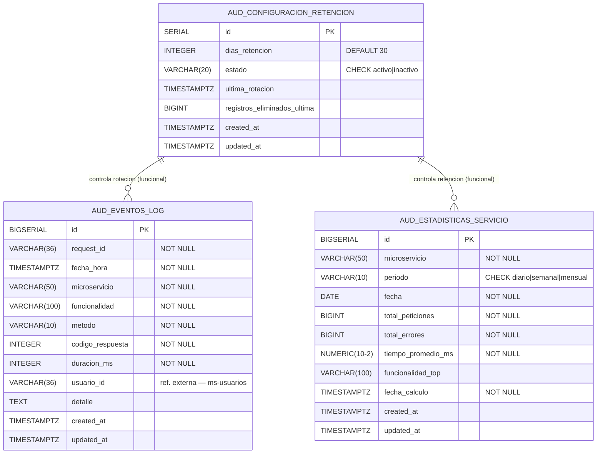

# Modelo de Datos — ms-auditoria [AUD]

---

## 1. Información General

| Campo | Detalle |
|---|---|
| **Nombre** | ms-auditoria |
| **Código** | AUD |
| **Módulo** | Módulo 6 — Transversales |
| **Base de datos sugerida** | `db_auditoria` |
| **Stack** | FastAPI + Python + PostgreSQL |
| **Cantidad de tablas** | 3 |

**Resumen del dominio de datos:** `ms-auditoria` es el servicio centralizado de trazabilidad del ERP universitario; almacena cada evento de log enviado de forma asíncrona por los 18+ microservicios del sistema. Complementa el almacenamiento de eventos con una tabla de configuración de retención que controla la rotación automática de registros antiguos, y con una tabla de estadísticas que consolida métricas de uso por servicio y periodo. No mantiene referencias a entidades de otros microservicios más allá del identificador del usuario que originó cada operación.

---

## 2. Diagrama E-R



### Descripción narrativa

El modelo cuenta con **3 entidades**. `aud_eventos_log` es la entidad principal y de mayor volumen: almacena todos los registros de operaciones enviados por cualquier microservicio del sistema, incluyendo el propio `ms-auditoria` (auto-auditoría). `aud_configuracion_retencion` es una entidad de configuración de tipo singleton que define cuántos días se conservan los logs y registra el resultado de la última rotación ejecutada. `aud_estadisticas_servicio` es una entidad analítica que almacena métricas precalculadas por microservicio y periodo para evitar agregar la tabla principal en tiempo real.

No existen FK reales entre las tres tablas; sus relaciones son funcionales (la lógica de negocio las relaciona, no la base de datos). La única **referencia externa** es `usuario_id` en `aud_eventos_log`, que apunta al identificador del usuario gestionado por `ms-usuarios` / `ms-autenticacion`.

---

## 3. Diccionario de Datos

### Tabla: `aud_eventos_log`

**Propósito:** Almacena cada registro de operación (log) enviado por cualquier microservicio del sistema. Es la tabla de mayor volumen y el núcleo del servicio de auditoría.

> **Referencia externa:** `usuario_id` → ID del usuario en `ms-usuarios` / `ms-autenticacion`. No se define FK real entre bases de datos distintas.

| Columna | Tipo | Restricciones | Descripción |
|---|---|---|---|
| `id` | `BIGSERIAL` | PK | Identificador interno autoincremental del registro de log |
| `request_id` | `VARCHAR(36)` | NOT NULL | Identificador de rastreo de la petición (UUID). Permite reconstruir la traza completa entre microservicios |
| `fecha_hora` | `TIMESTAMP WITH TIME ZONE` | NOT NULL | Fecha y hora exacta en que se ejecutó la operación en el microservicio origen |
| `microservicio` | `VARCHAR(50)` | NOT NULL | Nombre del microservicio que generó el log (ej: `ms-reservas`, `ms-auditoria`) |
| `funcionalidad` | `VARCHAR(100)` | NOT NULL | Nombre de la funcionalidad o endpoint ejecutado (ej: `crear_reserva`, `login`) |
| `metodo` | `VARCHAR(10)` | NOT NULL, CHECK | Método HTTP utilizado. Valores: `GET`, `POST`, `PUT`, `PATCH`, `DELETE`, `HEAD`, `OPTIONS` |
| `codigo_respuesta` | `INTEGER` | NOT NULL, CHECK (100–599) | Código de respuesta HTTP retornado |
| `duracion_ms` | `INTEGER` | NOT NULL, CHECK (>= 0) | Duración de la operación en milisegundos |
| `usuario_id` | `VARCHAR(36)` | NULL | **Ref. externa — ms-usuarios.** ID del usuario que realizó la operación. NULL para operaciones de sistema sin usuario |
| `detalle` | `TEXT` | NULL | Descripción libre del contexto o resultado de la operación |
| `created_at` | `TIMESTAMP WITH TIME ZONE` | NOT NULL, DEFAULT NOW() | Fecha/hora de inserción del registro |
| `updated_at` | `TIMESTAMP WITH TIME ZONE` | NOT NULL, DEFAULT NOW() | Fecha/hora de última modificación del registro |

---

### Tabla: `aud_configuracion_retencion`

**Propósito:** Almacena los parámetros de rotación automática de registros. Opera como singleton (un único registro activo). Registra también el historial de la última ejecución de rotación.

> No contiene referencias externas a otros microservicios.

| Columna | Tipo | Restricciones | Descripción |
|---|---|---|---|
| `id` | `SERIAL` | PK | Identificador interno |
| `dias_retencion` | `INTEGER` | NOT NULL, DEFAULT 30, CHECK (> 0) | Cantidad de días que se conservan los registros de log antes de ser eliminados |
| `estado` | `VARCHAR(20)` | NOT NULL, DEFAULT 'activo', CHECK | Estado de la configuración. Valores: `activo`, `inactivo`. Solo la configuración activa se aplica en la rotación |
| `ultima_rotacion` | `TIMESTAMP WITH TIME ZONE` | NULL | Fecha y hora de la última ejecución de rotación (automática o manual) |
| `registros_eliminados_ultima` | `BIGINT` | NULL, DEFAULT 0, CHECK (>= 0) | Cantidad de registros eliminados en la última ejecución de rotación |
| `created_at` | `TIMESTAMP WITH TIME ZONE` | NOT NULL, DEFAULT NOW() | Fecha/hora de creación del registro |
| `updated_at` | `TIMESTAMP WITH TIME ZONE` | NOT NULL, DEFAULT NOW() | Fecha/hora de última modificación |

---

### Tabla: `aud_estadisticas_servicio`

**Propósito:** Almacena métricas de uso precalculadas por microservicio y periodo. Evita agregar en tiempo real la tabla `aud_eventos_log` para consultas analíticas.

> No contiene referencias externas a otros microservicios. El campo `microservicio` almacena únicamente el nombre textual del servicio.

| Columna | Tipo | Restricciones | Descripción |
|---|---|---|---|
| `id` | `BIGSERIAL` | PK | Identificador interno autoincremental |
| `microservicio` | `VARCHAR(50)` | NOT NULL | Nombre del microservicio al que corresponde la estadística |
| `periodo` | `VARCHAR(10)` | NOT NULL, CHECK | Periodo de agrupación. Valores: `diario`, `semanal`, `mensual` |
| `fecha` | `DATE` | NOT NULL | Fecha de inicio del periodo estadístico |
| `total_peticiones` | `BIGINT` | NOT NULL, DEFAULT 0, CHECK (>= 0) | Total de peticiones registradas en el periodo |
| `total_errores` | `BIGINT` | NOT NULL, DEFAULT 0, CHECK (>= 0 y <= total_peticiones) | Total de respuestas con código de error (>= 400) en el periodo |
| `tiempo_promedio_ms` | `NUMERIC(10,2)` | NOT NULL, DEFAULT 0, CHECK (>= 0) | Tiempo promedio de respuesta en milisegundos durante el periodo |
| `funcionalidad_top` | `VARCHAR(100)` | NULL | Nombre de la funcionalidad más utilizada en el periodo |
| `fecha_calculo` | `TIMESTAMP WITH TIME ZONE` | NOT NULL | Fecha y hora en que se calculó y almacenó esta estadística |
| `created_at` | `TIMESTAMP WITH TIME ZONE` | NOT NULL, DEFAULT NOW() | Fecha/hora de inserción del registro |
| `updated_at` | `TIMESTAMP WITH TIME ZONE` | NOT NULL, DEFAULT NOW() | Fecha/hora de última modificación |

---

## 4. Relaciones y Claves Foráneas

### Relaciones internas (FK dentro de `db_auditoria`)

No existen claves foráneas entre las tres tablas del microservicio. Las tablas son independientes a nivel de base de datos; su relación es exclusivamente funcional (la configuración de retención controla qué registros se eliminan; las estadísticas se calculan a partir de los eventos de log).

| FK | Tabla origen | Columna | Tabla destino | Tipo | Nota |
|---|---|---|---|---|---|
| — | — | — | — | — | No hay FK internas en este modelo |

### Referencias externas (sin FK real en base de datos)

| Referencia | Tabla origen | Columna | Entidad destino | Microservicio | Nota |
|---|---|---|---|---|---|
| `ref_usuario_id` | `aud_eventos_log` | `usuario_id` | Usuario | `ms-usuarios` / `ms-autenticacion` | ID del usuario que realizó la operación. Puede ser NULL en operaciones de sistema |

---

## 5. Índices Sugeridos

| Índice | Tabla | Columnas | Tipo | Justificación |
|---|---|---|---|---|
| `idx_aud_eventos_request_id` | `aud_eventos_log` | `request_id` | B-tree | Consulta principal: reconstrucción de traza completa por Request ID |
| `idx_aud_eventos_microservicio` | `aud_eventos_log` | `microservicio` | B-tree | Filtro por microservicio de origen (requisito funcional explícito) |
| `idx_aud_eventos_fecha_hora` | `aud_eventos_log` | `fecha_hora` | B-tree | Filtro por rango de fechas y rotación automática (DELETE de registros antiguos) |
| `idx_aud_eventos_microservicio_fecha` | `aud_eventos_log` | `microservicio, fecha_hora` | B-tree compuesto | Combinación de filtros más frecuente según requisitos funcionales |
| `idx_aud_eventos_codigo_respuesta` | `aud_eventos_log` | `codigo_respuesta` | B-tree | Filtro para identificar errores y calcular `total_errores` en estadísticas |
| `idx_aud_eventos_usuario_id` | `aud_eventos_log` | `usuario_id` | B-tree parcial (WHERE NOT NULL) | Búsqueda de actividad por usuario específico |
| `idx_aud_estadisticas_ms_periodo_fecha` | `aud_estadisticas_servicio` | `microservicio, periodo, fecha` | B-tree compuesto | Cubre la restricción UNIQUE y las consultas de estadísticas por servicio |
| `idx_aud_config_estado` | `aud_configuracion_retencion` | `estado` | B-tree | Obtención rápida de la configuración activa en cada ejecución de rotación |

---

## 6. Script DDL

```sql
-- ============================================================
-- BASE DE DATOS: db_auditoria
-- Microservicio: ms-auditoria [AUD]
-- Módulo: 6 — Transversales
-- Stack: FastAPI + Python + PostgreSQL
-- ============================================================

CREATE DATABASE db_auditoria
    WITH ENCODING = 'UTF8'
    LC_COLLATE = 'es_CO.UTF-8'
    LC_CTYPE   = 'es_CO.UTF-8'
    TEMPLATE   = template0;

\connect db_auditoria;

-- ============================================================
-- TABLA: aud_configuracion_retencion
-- Sin dependencias previas — se crea primero.
-- ============================================================
CREATE TABLE aud_configuracion_retencion (
    id                              SERIAL                      NOT NULL,
    dias_retencion                  INTEGER                     NOT NULL    DEFAULT 30,
    estado                          VARCHAR(20)                 NOT NULL    DEFAULT 'activo',
    ultima_rotacion                 TIMESTAMP WITH TIME ZONE                DEFAULT NULL,
    registros_eliminados_ultima     BIGINT                                  DEFAULT 0,
    created_at                      TIMESTAMP WITH TIME ZONE    NOT NULL    DEFAULT NOW(),
    updated_at                      TIMESTAMP WITH TIME ZONE    NOT NULL    DEFAULT NOW(),

    CONSTRAINT pk_aud_configuracion_retencion   PRIMARY KEY (id),
    CONSTRAINT chk_aud_config_dias              CHECK (dias_retencion > 0),
    CONSTRAINT chk_aud_config_estado            CHECK (estado IN ('activo', 'inactivo')),
    CONSTRAINT chk_aud_config_registros         CHECK (registros_eliminados_ultima >= 0)
);

COMMENT ON TABLE  aud_configuracion_retencion
    IS 'Parámetros de rotación automática de registros de log. Opera como singleton (un único registro activo).';
COMMENT ON COLUMN aud_configuracion_retencion.dias_retencion
    IS 'Cantidad de días que se conservan los eventos de log antes de ser eliminados por la rotación.';
COMMENT ON COLUMN aud_configuracion_retencion.estado
    IS 'Estado de la configuración: activo | inactivo. Solo la config activa se aplica en la rotación.';
COMMENT ON COLUMN aud_configuracion_retencion.ultima_rotacion
    IS 'Fecha y hora de la última rotación ejecutada (automática o manual).';
COMMENT ON COLUMN aud_configuracion_retencion.registros_eliminados_ultima
    IS 'Cantidad de registros eliminados en la última ejecución de rotación.';

-- ============================================================
-- TABLA: aud_eventos_log
-- Tabla principal de alto volumen.
--
-- REFERENCIA EXTERNA (sin FK real — database-per-service):
--   usuario_id → ID del usuario en ms-usuarios / ms-autenticacion
-- ============================================================
CREATE TABLE aud_eventos_log (
    id                  BIGSERIAL                   NOT NULL,
    request_id          VARCHAR(36)                 NOT NULL,
    fecha_hora          TIMESTAMP WITH TIME ZONE    NOT NULL,
    microservicio       VARCHAR(50)                 NOT NULL,
    funcionalidad       VARCHAR(100)                NOT NULL,
    metodo              VARCHAR(10)                 NOT NULL,
    codigo_respuesta    INTEGER                     NOT NULL,
    duracion_ms         INTEGER                     NOT NULL,
    -- [REFERENCIA EXTERNA] usuario_id → ms-usuarios / ms-autenticacion
    -- No se define FK real (arquitectura database-per-service).
    -- NULL permitido para operaciones de sistema sin usuario.
    usuario_id          VARCHAR(36)                             DEFAULT NULL,
    detalle             TEXT                                    DEFAULT NULL,
    created_at          TIMESTAMP WITH TIME ZONE    NOT NULL    DEFAULT NOW(),
    updated_at          TIMESTAMP WITH TIME ZONE    NOT NULL    DEFAULT NOW(),

    CONSTRAINT pk_aud_eventos_log           PRIMARY KEY (id),
    CONSTRAINT chk_aud_eventos_metodo       CHECK (metodo IN ('GET', 'POST', 'PUT', 'PATCH', 'DELETE', 'HEAD', 'OPTIONS')),
    CONSTRAINT chk_aud_eventos_codigo       CHECK (codigo_respuesta BETWEEN 100 AND 599),
    CONSTRAINT chk_aud_eventos_duracion     CHECK (duracion_ms >= 0)
);

COMMENT ON TABLE  aud_eventos_log
    IS 'Registro central de operaciones (logs) enviados de forma asíncrona por todos los microservicios del sistema.';
COMMENT ON COLUMN aud_eventos_log.request_id
    IS 'UUID de rastreo de la petición. Permite reconstruir la traza completa a través de múltiples microservicios.';
COMMENT ON COLUMN aud_eventos_log.microservicio
    IS 'Nombre del microservicio origen del log (ej: ms-reservas, ms-auditoria).';
COMMENT ON COLUMN aud_eventos_log.usuario_id
    IS '[REFERENCIA EXTERNA] ID del usuario en ms-usuarios / ms-autenticacion. NULL para operaciones de sistema sin usuario.';

-- ============================================================
-- TABLA: aud_estadisticas_servicio
-- Métricas precalculadas por microservicio y periodo.
-- Restricción UNIQUE: (microservicio, periodo, fecha)
-- ============================================================
CREATE TABLE aud_estadisticas_servicio (
    id                  BIGSERIAL                   NOT NULL,
    microservicio       VARCHAR(50)                 NOT NULL,
    periodo             VARCHAR(10)                 NOT NULL,
    fecha               DATE                        NOT NULL,
    total_peticiones    BIGINT                      NOT NULL    DEFAULT 0,
    total_errores       BIGINT                      NOT NULL    DEFAULT 0,
    tiempo_promedio_ms  NUMERIC(10,2)               NOT NULL    DEFAULT 0,
    funcionalidad_top   VARCHAR(100)                            DEFAULT NULL,
    fecha_calculo       TIMESTAMP WITH TIME ZONE    NOT NULL,
    created_at          TIMESTAMP WITH TIME ZONE    NOT NULL    DEFAULT NOW(),
    updated_at          TIMESTAMP WITH TIME ZONE    NOT NULL    DEFAULT NOW(),

    CONSTRAINT pk_aud_estadisticas_servicio     PRIMARY KEY (id),
    CONSTRAINT uq_aud_estad_ms_periodo_fecha    UNIQUE (microservicio, periodo, fecha),
    CONSTRAINT chk_aud_estad_periodo            CHECK (periodo IN ('diario', 'semanal', 'mensual')),
    CONSTRAINT chk_aud_estad_peticiones         CHECK (total_peticiones >= 0),
    CONSTRAINT chk_aud_estad_errores            CHECK (total_errores >= 0),
    CONSTRAINT chk_aud_estad_errores_max        CHECK (total_errores <= total_peticiones),
    CONSTRAINT chk_aud_estad_tiempo             CHECK (tiempo_promedio_ms >= 0)
);

COMMENT ON TABLE  aud_estadisticas_servicio
    IS 'Estadísticas de uso precalculadas por microservicio y periodo (diario, semanal, mensual).';
COMMENT ON COLUMN aud_estadisticas_servicio.periodo
    IS 'Periodo de agrupación: diario | semanal | mensual.';
COMMENT ON COLUMN aud_estadisticas_servicio.fecha
    IS 'Fecha de inicio del periodo estadístico.';
COMMENT ON COLUMN aud_estadisticas_servicio.funcionalidad_top
    IS 'Nombre de la funcionalidad más utilizada durante el periodo.';
COMMENT ON COLUMN aud_estadisticas_servicio.fecha_calculo
    IS 'Timestamp en que se ejecutó el cálculo y se insertó/actualizó este registro.';

-- ============================================================
-- ÍNDICES
-- ============================================================

-- Reconstrucción de traza por Request ID (consulta principal del servicio)
CREATE INDEX idx_aud_eventos_request_id
    ON aud_eventos_log (request_id);

-- Filtro por microservicio de origen (requisito funcional explícito)
CREATE INDEX idx_aud_eventos_microservicio
    ON aud_eventos_log (microservicio);

-- Filtro por fecha/hora (rangos y proceso de rotación automática)
CREATE INDEX idx_aud_eventos_fecha_hora
    ON aud_eventos_log (fecha_hora);

-- Filtro combinado microservicio + fecha (consulta más frecuente)
CREATE INDEX idx_aud_eventos_microservicio_fecha
    ON aud_eventos_log (microservicio, fecha_hora);

-- Filtro por código de respuesta (cálculo de errores en estadísticas)
CREATE INDEX idx_aud_eventos_codigo_respuesta
    ON aud_eventos_log (codigo_respuesta);

-- Búsqueda de actividad por usuario (índice parcial, excluye NULLs)
CREATE INDEX idx_aud_eventos_usuario_id
    ON aud_eventos_log (usuario_id)
    WHERE usuario_id IS NOT NULL;

-- Estadísticas: cubre la UNIQUE constraint y consultas por servicio/periodo
CREATE INDEX idx_aud_estadisticas_ms_periodo_fecha
    ON aud_estadisticas_servicio (microservicio, periodo, fecha);

-- Obtención rápida de la configuración activa
CREATE INDEX idx_aud_config_estado
    ON aud_configuracion_retencion (estado);
```

---

## 7. Datos Semilla

```sql
-- ============================================================
-- DATOS SEMILLA — ms-auditoria [AUD]
-- Base de datos: db_auditoria
-- ============================================================

-- ------------------------------------------------------------
-- aud_configuracion_retencion
-- Singleton operativo: un registro activo y tres inactivos
-- que representan configuraciones anteriores o alternativas.
-- ------------------------------------------------------------
INSERT INTO aud_configuracion_retencion
    (dias_retencion, estado, ultima_rotacion, registros_eliminados_ultima, created_at, updated_at)
VALUES
    -- 1. Configuración activa: valor por defecto del sistema (30 días)
    (30,  'activo',   '2026-02-01 03:00:00+00', 15842, NOW(), NOW()),
    -- 2. Configuración inactiva: usada anteriormente con retención extendida
    (60,  'inactivo', '2026-01-01 03:00:00+00', 8210,  NOW(), NOW()),
    -- 3. Configuración inactiva: retención corta para entorno de pruebas
    (7,   'inactivo', NULL,                      0,     NOW(), NOW()),
    -- 4. Configuración inactiva: retención extendida para cumplimiento normativo
    (365, 'inactivo', NULL,                      0,     NOW(), NOW());

-- ------------------------------------------------------------
-- aud_eventos_log
-- Cubre distintos microservicios, métodos, códigos de respuesta,
-- trazas multi-servicio (mismo request_id) y operaciones con y sin usuario.
--
-- IDs de usuario ficticios (REFERENCIAS EXTERNAS):
--   'usr-0001-uuid-admin'    → Usuario administrador    — ms-usuarios
--   'usr-0002-uuid-docente'  → Usuario docente          — ms-usuarios
--   'usr-0003-uuid-student'  → Usuario estudiante       — ms-usuarios
--   NULL                     → Operación de sistema (scheduler, rotación, etc.)
-- ------------------------------------------------------------
INSERT INTO aud_eventos_log
    (request_id, fecha_hora, microservicio, funcionalidad,
     metodo, codigo_respuesta, duracion_ms, usuario_id, detalle,
     created_at, updated_at)
VALUES
    -- 1. Login exitoso — ms-autenticacion
    ('a1b2c3d4-0001-0001-0001-000000000001',
     '2026-02-15 08:05:12+00', 'ms-autenticacion', 'login',
     'POST', 200, 145, 'usr-0001-uuid-admin',
     'Inicio de sesión exitoso para usuario administrador.',
     NOW(), NOW()),

    -- 2. Misma traza en ms-roles (mismo request_id → traza completa)
    ('a1b2c3d4-0001-0001-0001-000000000001',
     '2026-02-15 08:05:12+00', 'ms-roles', 'verificar_permisos',
     'GET', 200, 32, 'usr-0001-uuid-admin',
     'Permisos verificados para rol ADMIN.',
     NOW(), NOW()),

    -- 3. Creación de reserva exitosa — ms-reservas (201 Created)
    ('b2c3d4e5-0002-0002-0002-000000000002',
     '2026-02-15 09:30:45+00', 'ms-reservas', 'crear_reserva',
     'POST', 201, 312, 'usr-0002-uuid-docente',
     'Reserva creada para espacio A-101, fecha 2026-02-20.',
     NOW(), NOW()),

    -- 4. Error de validación — ms-inventario (400 Bad Request)
    ('c3d4e5f6-0003-0003-0003-000000000003',
     '2026-02-15 10:15:00+00', 'ms-inventario', 'registrar_salida',
     'POST', 400, 78, 'usr-0001-uuid-admin',
     'Stock insuficiente para el item solicitado.',
     NOW(), NOW()),

    -- 5. Error interno de servidor — ms-facturacion (500)
    ('d4e5f6a7-0004-0004-0004-000000000004',
     '2026-02-15 11:00:00+00', 'ms-facturacion', 'generar_factura',
     'POST', 500, 2340, 'usr-0003-uuid-student',
     'Error al conectar con el proveedor de firma electrónica.',
     NOW(), NOW()),

    -- 6. Operación de sistema sin usuario — ms-reportes (scheduler nocturno)
    ('e5f6a7b8-0005-0005-0005-000000000005',
     '2026-02-15 03:00:00+00', 'ms-reportes', 'generar_reporte_diario',
     'POST', 200, 8920, NULL,
     'Reporte diario generado automáticamente por scheduler.',
     NOW(), NOW()),

    -- 7. Auto-auditoría: ms-auditoria registra su propia rotación automática
    ('f6a7b8c9-0006-0006-0006-000000000006',
     '2026-02-15 03:05:00+00', 'ms-auditoria', 'ejecutar_rotacion',
     'POST', 200, 4521, NULL,
     'Rotación automática ejecutada. 15842 registros eliminados.',
     NOW(), NOW()),

    -- 8. Consulta de logs paginada — ms-auditoria (auto-auditoría de consulta)
    ('a7b8c9d0-0007-0007-0007-000000000007',
     '2026-02-15 14:22:10+00', 'ms-auditoria', 'consultar_logs',
     'GET', 200, 89, 'usr-0001-uuid-admin',
     'Consulta de logs filtrada por ms-reservas, página 1.',
     NOW(), NOW()),

    -- 9. Actualización parcial — ms-matriculas (PATCH exitoso)
    ('b8c9d0e1-0008-0008-0008-000000000008',
     '2026-02-16 07:45:00+00', 'ms-matriculas', 'actualizar_estado_matricula',
     'PATCH', 200, 210, 'usr-0001-uuid-admin',
     'Matrícula MAT-2026-0042 cambiada a estado activa.',
     NOW(), NOW()),

    -- 10. Acceso no autorizado — ms-calificaciones (403 Forbidden)
    ('c9d0e1f2-0009-0009-0009-000000000009',
     '2026-02-16 09:10:30+00', 'ms-calificaciones', 'editar_calificacion',
     'PUT', 403, 55, 'usr-0003-uuid-student',
     'Usuario no tiene permiso para editar calificaciones.',
     NOW(), NOW()),

    -- 11. Eliminación lógica — ms-usuarios (DELETE → 200)
    ('d0e1f2a3-0010-0010-0010-000000000010',
     '2026-02-16 10:00:00+00', 'ms-usuarios', 'eliminar_usuario',
     'DELETE', 200, 178, 'usr-0001-uuid-admin',
     'Usuario desactivado lógicamente (soft delete).',
     NOW(), NOW()),

    -- 12. Recurso no encontrado — ms-espacios (404 Not Found)
    ('e1f2a3b4-0011-0011-0011-000000000011',
     '2026-02-16 11:30:00+00', 'ms-espacios', 'obtener_espacio',
     'GET', 404, 45, 'usr-0002-uuid-docente',
     'Espacio con ID ESP-9999 no encontrado.',
     NOW(), NOW());

-- ------------------------------------------------------------
-- aud_estadisticas_servicio
-- Cubre los tres periodos (diario, semanal, mensual)
-- y varios microservicios con distintos volúmenes de tráfico.
-- ------------------------------------------------------------
INSERT INTO aud_estadisticas_servicio
    (microservicio, periodo, fecha,
     total_peticiones, total_errores, tiempo_promedio_ms,
     funcionalidad_top, fecha_calculo, created_at, updated_at)
VALUES
    -- Estadísticas diarias (2026-02-15)
    ('ms-autenticacion', 'diario', '2026-02-15',
     4820,  312, 98.50,  'login',                '2026-02-16 00:05:00+00', NOW(), NOW()),
    ('ms-reservas',      'diario', '2026-02-15',
     1345,  87,  285.30, 'crear_reserva',         '2026-02-16 00:05:00+00', NOW(), NOW()),
    ('ms-matriculas',    'diario', '2026-02-15',
     980,   45,  195.10, 'consultar_matriculas',  '2026-02-16 00:05:00+00', NOW(), NOW()),
    ('ms-facturacion',   'diario', '2026-02-15',
     620,   58,  540.70, 'generar_factura',       '2026-02-16 00:05:00+00', NOW(), NOW()),

    -- Estadísticas semanales (semana del 2026-02-09)
    ('ms-autenticacion', 'semanal', '2026-02-09',
     31250, 2140, 102.30, 'login',               '2026-02-16 00:10:00+00', NOW(), NOW()),
    ('ms-reservas',      'semanal', '2026-02-09',
     8970,  610,  278.50, 'crear_reserva',        '2026-02-16 00:10:00+00', NOW(), NOW()),

    -- Estadísticas mensuales (febrero 2026)
    ('ms-autenticacion',  'mensual', '2026-02-01',
     125400, 8720, 99.80,  'login',              '2026-02-16 00:15:00+00', NOW(), NOW()),
    ('ms-auditoria',      'mensual', '2026-02-01',
     48200,  320,  112.40, 'consultar_logs',     '2026-02-16 00:15:00+00', NOW(), NOW()),
    ('ms-inventario',     'mensual', '2026-02-01',
     19800,  1240, 225.60, 'consultar_stock',    '2026-02-16 00:15:00+00', NOW(), NOW()),
    ('ms-calificaciones', 'mensual', '2026-02-01',
     15600,  480,  188.90, 'registrar_nota',     '2026-02-16 00:15:00+00', NOW(), NOW());
```
